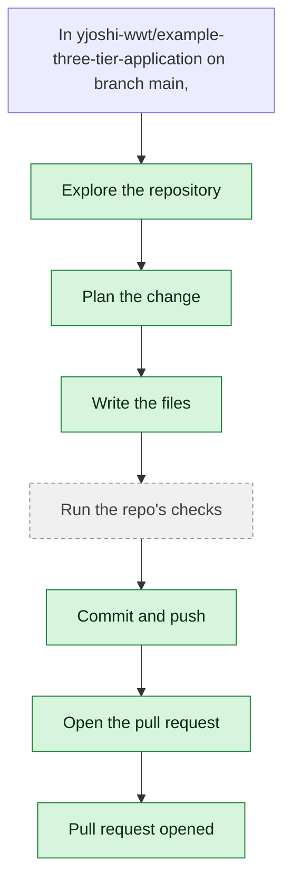

# yjoshi-wwt/example-three-tier-application — 2026-08-05

> In yjoshi-wwt/example-three-tier-application on branch main, add a "Troubleshooting" section to README.md covering the three most likely local setup failures. Read the existing README first. Change only README.md.

| | |
| --- | --- |
| Job | `4ecdbb25-f9fe-4256-acb7-eece0cdd7402` |
| Repository | [yjoshi-wwt/example-three-tier-application](https://github.com/yjoshi-wwt/example-three-tier-application) |
| Base branch | `main` |
| Work branch | [`agent/4ecdbb25`](https://github.com/yjoshi-wwt/example-three-tier-application/tree/agent/4ecdbb25) |
| Pull request | https://github.com/yjoshi-wwt/example-three-tier-application/pull/8 |
| Duration | 44.9s |
| Logs | [CloudWatch Logs Insights](https://us-east-1.console.aws.amazon.com/cloudwatch/home?region=us-east-1#logsV2:logs-insights?queryDetail=~(end~'2026-08-05T19%3A11%3A45.728Z~start~'2026-08-05T19%3A09%3A00.790Z~timeType~'ABSOLUTE~tz~'UTC~editorString~'fields*20*40timestamp*2C*20level*2C*20msg*2C*20jobId*0A*7C*20filter*20jobId*20*3D*20'4ecdbb25-f9fe-4256-acb7-eece0cdd7402'*20or*20*40message*20like*20'4ecdbb25-f9fe-4256-acb7-eece0cdd7402'*0A*7C*20sort*20*40timestamp*20asc*0A*7C*20limit*20500~source~(~'*2Faine-forge*2Forchestrator))) |

## How the run went

The agent was asked to work in **yjoshi-wwt/example-three-tier-application** from `main`. It began by exploring the repository rather than guessing: it opened 2 file(s) — `README.md`, `docker-compose.yml`.

From what it read, it settled on 1 step(s):

1. **Add Troubleshooting section to README.md** — Insert a new 'Troubleshooting' section after the 'Rebuild after code changes' subsection in the 'Running locally with Docker Compose' section, covering three common local setup failures: Docker not running/installed, port conflicts (3000/3001), and database initialization/resource issues.

It then wrote 1 file(s) — `README.md` — and landed them on `agent/4ecdbb25` as one commit (`3cd4e9d`), after the checks had seen the whole tree. Nothing was committed to the base branch: the only route there is the pull request.

The run ends at https://github.com/yjoshi-wwt/example-three-tier-application/pull/8, ready for review.

## The route it took

## Every step, in order

| # | Time | Step | What happened |
| --- | --- | --- | --- |
| 1 | 19:10:00 | `message` | Working in yjoshi-wwt/example-three-tier-application |
| 2 | 19:10:04 | `run` | Read README.md — `README.md` |
| 3 | 19:10:09 | `run` | Listed / — 7 entries |
| 4 | 19:10:09 | `run` | Listed src — 4 entries — `src` |
| 5 | 19:10:12 | `run` | Read docker-compose.yml — `docker-compose.yml` |
| 6 | 19:10:19 | `plan` | Add Troubleshooting section to README.md — `Insert a new 'Troubleshooting' section after the 'Rebuild after code changes' subsection in the 'Running locally with Docker Compose' section, covering three co` |
| 7 | 19:10:20 | `commit` | Created branch agent/4ecdbb25 |
| 8 | 19:10:25 | `run` | Read README.md — `README.md` |
| 9 | 19:10:37 | `edit` | Wrote README.md — `README.md` |
| 10 | 19:10:42 | `push` | Pushed 1 file(s) to agent/4ecdbb25 |
| 11 | 19:10:45 | `pr` | Opened PR #8 — `https://github.com/yjoshi-wwt/example-three-tier-application/pull/8` |

---

_Generated by the FORGE code agent. Each interaction gets its own file in `docs/runs/`._