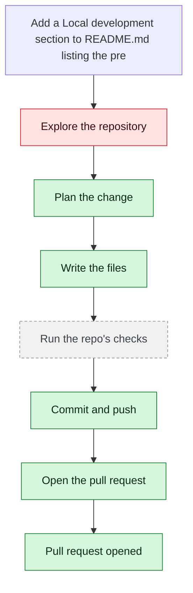

# yjoshi-wwt/example-three-tier-application — 2026-08-05

> Add a 'Local development' section to README.md listing the prerequisites and the commands to run each tier locally. Read the existing README and the tier directories first and base it on what the repo actually contains. Change only README.md.

| | |
| --- | --- |
| Job | `a782c4f2-2bff-4f26-aa0e-4ea5cee14415` |
| Repository | [yjoshi-wwt/example-three-tier-application](https://github.com/yjoshi-wwt/example-three-tier-application) |
| Base branch | `main` |
| Work branch | [`agent/a782c4f2`](https://github.com/yjoshi-wwt/example-three-tier-application/tree/agent/a782c4f2) |
| Pull request | https://github.com/yjoshi-wwt/example-three-tier-application/pull/7 |
| Duration | 70.2s |
| Logs | [CloudWatch Logs Insights](https://us-east-1.console.aws.amazon.com/cloudwatch/home?region=us-east-1#logsV2:logs-insights?queryDetail=~(end~'2026-08-05T15%3A32%3A51.415Z~start~'2026-08-05T15%3A29%3A41.243Z~timeType~'ABSOLUTE~tz~'UTC~editorString~'fields*20*40timestamp*2C*20level*2C*20msg*2C*20jobId*0A*7C*20filter*20jobId*20*3D*20'a782c4f2-2bff-4f26-aa0e-4ea5cee14415'*20or*20*40message*20like*20'a782c4f2-2bff-4f26-aa0e-4ea5cee14415'*0A*7C*20sort*20*40timestamp*20asc*0A*7C*20limit*20500~source~(~'*2Faine-forge*2Forchestrator))) |

## How the run went

The agent was asked to work in **yjoshi-wwt/example-three-tier-application** from `main`. It began by exploring the repository rather than guessing: it opened 14 file(s) — `README.md`, `src/api/package.json`, `src/web/package.json`, `src/db/package.json`, `docker-compose.yml`, `api`, `web`, `db`, among others.

From what it read, it settled on 1 step(s):

1. **Add 'Local development' section to README.md** — Insert a new section after the 'Running locally with Docker Compose' section that documents prerequisites (Node.js, npm, PostgreSQL) and provides step-by-step commands to run each tier locally: database setup with migrations, API server with npm run dev, and web frontend with npm run dev, including required environment variables for each tier.

It then wrote 1 file(s) — `README.md` — each as its own commit on `agent/a782c4f2`. Nothing was committed to the base branch: the only route there is the pull request.

Things that went wrong along the way: **Could not read api**; **Could not read web**; **Could not read db**.

The run ends at https://github.com/yjoshi-wwt/example-three-tier-application/pull/7, ready for review.

## The route it took

## Every step, in order

| # | Time | Step | What happened |
| --- | --- | --- | --- |
| 1 | 15:30:41 | `message` | Working in yjoshi-wwt/example-three-tier-application @ main |
| 2 | 15:30:44 | `run` | Listed / — 7 entries |
| 3 | 15:30:45 | `run` | Read README.md — `README.md` |
| 4 | 15:30:47 | `run` | Listed src — 4 entries — `src` |
| 5 | 15:30:48 | `run` | Listed src/api — 6 entries — `src/api` |
| 6 | 15:30:48 | `run` | Listed src/web — 14 entries — `src/web` |
| 7 | 15:30:48 | `run` | Listed src/db — 5 entries — `src/db` |
| 8 | 15:30:51 | `run` | Read src/api/package.json — `src/api/package.json` |
| 9 | 15:30:52 | `run` | Read src/web/package.json — `src/web/package.json` |
| 10 | 15:30:53 | `run` | Read src/db/package.json — `src/db/package.json` |
| 11 | 15:30:55 | `run` | Read docker-compose.yml — `docker-compose.yml` |
| 12 | 15:31:04 | `plan` | Add 'Local development' section to README.md — `Insert a new section after the 'Running locally with Docker Compose' section that documents prerequisites (Node.js, npm, PostgreSQL) and provides step-by-step c` |
| 13 | 15:31:06 | `commit` | Created branch agent/a782c4f2 |
| 14 | 15:31:11 | `run` | Read README.md — `README.md` |
| 15 | 15:31:11 | `error` | Could not read api — `GitHub read_file failed for yjoshi-wwt/example-three-tier-application/api @ main (404 Not Found). Repo, path, or branch not found — or the token can't access it` |
| 16 | 15:31:12 | `error` | Could not read web — `GitHub read_file failed for yjoshi-wwt/example-three-tier-application/web @ main (404 Not Found). Repo, path, or branch not found — or the token can't access it` |
| 17 | 15:31:12 | `error` | Could not read db — `GitHub read_file failed for yjoshi-wwt/example-three-tier-application/db @ main (404 Not Found). Repo, path, or branch not found — or the token can't access it.` |
| 18 | 15:31:15 | `run` | Listed src/api — 6 entries — `src/api` |
| 19 | 15:31:16 | `run` | Listed src/web — 14 entries — `src/web` |
| 20 | 15:31:16 | `run` | Listed src/db — 5 entries — `src/db` |
| 21 | 15:31:20 | `run` | Read src/api/package.json — `src/api/package.json` |
| 22 | 15:31:20 | `run` | Read src/web/package.json — `src/web/package.json` |
| 23 | 15:31:21 | `run` | Read src/db/package.json — `src/db/package.json` |
| 24 | 15:31:24 | `run` | Read src/api/index.js — `src/api/index.js` |
| 25 | 15:31:25 | `run` | Listed src/web/app — 5 entries — `src/web/app` |
| 26 | 15:31:28 | `run` | Read src/api/db.js — `src/api/db.js` |
| 27 | 15:31:42 | `edit` | Wrote README.md — `README.md` |
| 28 | 15:31:48 | `push` | Pushed 1 file(s) to agent/a782c4f2 |
| 29 | 15:31:51 | `pr` | Opened PR #7 — `https://github.com/yjoshi-wwt/example-three-tier-application/pull/7` |

---

_Generated by the FORGE code agent. Each interaction gets its own file in `docs/runs/`._