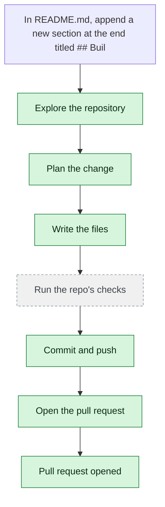

# yjoshi-wwt/example-three-tier-application — 2026-08-06

> In README.md, append a new section at the end titled "## Build" with the single line "CI runs on every pull request." Change nothing else.

| | |
| --- | --- |
| Job | `5bdce994-4852-41df-8198-e87332b4e237` |
| Repository | [yjoshi-wwt/example-three-tier-application](https://github.com/yjoshi-wwt/example-three-tier-application) |
| Base branch | `devin/e2e-merge-test-base` |
| Work branch | [`agent/5bdce994`](https://github.com/yjoshi-wwt/example-three-tier-application/tree/agent/5bdce994) |
| Pull request | https://github.com/yjoshi-wwt/example-three-tier-application/pull/11 |
| Duration | 32.7s |

## How the run went

The agent was asked to work in **yjoshi-wwt/example-three-tier-application** from `devin/e2e-merge-test-base`. It began by exploring the repository rather than guessing: it opened 1 file(s) — `README.md`.

From what it read, it settled on 1 step(s):

1. **Append Build section to README.md** — Add a new section at the end of README.md with the title '## Build' followed by the line 'CI runs on every pull request.' This will be appended after the database migrations section.

It then wrote 1 file(s) — `README.md` — committing each to `agent/5bdce994` as it went. Nothing was committed to the base branch: the only route there is the pull request.

Things that went wrong along the way: **git_diff failed**.

The run ends at https://github.com/yjoshi-wwt/example-three-tier-application/pull/11, ready for review.

## The route it took

## Every step, in order

| # | Time | Step | What happened |
| --- | --- | --- | --- |
| 1 | 07:22:57 | `message` | Working in yjoshi-wwt/example-three-tier-application @ devin/e2e-merge-test-base |
| 2 | 07:22:58 | `state` | Agent state: planning |
| 3 | 07:22:59 | `run` | Listed / — 7 entries |
| 4 | 07:22:59 | `run` | Read README.md — `README.md` |
| 5 | 07:23:01 | `plan` | Append Build section to README.md — `Add a new section at the end of README.md with the title '## Build' followed by the line 'CI runs on every pull request.' This will be appended after the databa` |
| 6 | 07:23:02 | `commit` | Created branch agent/5bdce994 |
| 7 | 07:23:02 | `state` | Agent state: executing |
| 8 | 07:23:04 | `run` | Read README.md — `README.md` |
| 9 | 07:23:13 | `edit` | Wrote README.md — `README.md` |
| 10 | 07:23:14 | `error` | git_diff failed — `Diffing agent/5bdce994 needs a sandbox on this deploy.` |
| 11 | 07:23:15 | `state` | Agent state: observing |
| 12 | 07:23:15 | `push` | Pushed 1 file(s) to agent/5bdce994 |
| 13 | 07:23:19 | `pr` | Opened PR #11 — `https://github.com/yjoshi-wwt/example-three-tier-application/pull/11` |
| 14 | 07:23:30 | `build` | Build passed (1 check) — `https://github.com/yjoshi-wwt/example-three-tier-application/commit/771b953706d21bdfa8073221be0b09b2c9848c8e/checks` |

---

_Generated by the FORGE code agent. Each interaction gets its own file in `docs/runs/`._