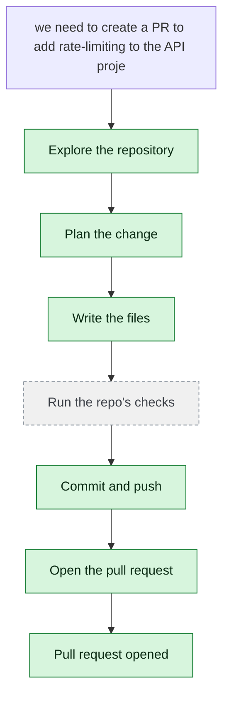

# yjoshi-wwt/example-three-tier-application — 2026-08-06

> we need to create a PR to add rate-limiting to the API project in the code base

| | |
| --- | --- |
| Job | `5e8e189c-98b6-40b0-92c0-ff5b4cad760d` |
| Repository | [yjoshi-wwt/example-three-tier-application](https://github.com/yjoshi-wwt/example-three-tier-application) |
| Base branch | `main` |
| Work branch | [`agent/5e8e189c`](https://github.com/yjoshi-wwt/example-three-tier-application/tree/agent/5e8e189c) |
| Pull request | https://github.com/yjoshi-wwt/example-three-tier-application/pull/13 |
| Duration | 73.1s |
| Logs | [CloudWatch Logs Insights](https://us-east-1.console.aws.amazon.com/cloudwatch/home?region=us-east-1#logsV2:logs-insights?queryDetail=~(end~'2026-08-06T10%3A41%3A36.697Z~start~'2026-08-06T10%3A38%3A23.560Z~timeType~'ABSOLUTE~tz~'UTC~editorString~'fields*20*40timestamp*2C*20level*2C*20msg*2C*20jobId*0A*7C*20filter*20jobId*20*3D*20'5e8e189c-98b6-40b0-92c0-ff5b4cad760d'*20or*20*40message*20like*20'5e8e189c-98b6-40b0-92c0-ff5b4cad760d'*0A*7C*20sort*20*40timestamp*20asc*0A*7C*20limit*20500~source~(~'*2Faine-forge*2Forchestrator))) |

## How the run went

The agent was asked to work in **yjoshi-wwt/example-three-tier-application** from `main`. It began by exploring the repository rather than guessing: it opened 7 file(s) — `src/api/package.json`, `src/api/index.js`, `src/api/db.js`, `.`, `src`, `README.md`, `src/api/Dockerfile`.

From what it read, it settled on 5 step(s):

1. **Add express-rate-limit dependency to package.json** — Update src/api/package.json to include the express-rate-limit package as a dependency, which is the standard rate-limiting middleware for Express applications.
1. **Create a rate-limiting middleware module** — Create a new file src/api/rateLimiter.js that configures and exports rate-limiting middleware with appropriate limits for different endpoints (e.g., stricter limits for POST/PATCH, looser for GET).
1. **Integrate rate-limiting middleware into the Express app** — Update src/api/index.js to import and apply the rate-limiting middleware to the Express app, protecting all endpoints with configurable rate limits.
1. **Update Dockerfile if needed for new dependencies** — Verify that src/api/Dockerfile properly installs dependencies via npm install so the new express-rate-limit package is included in the container build.
1. **Document rate-limiting configuration** — Update the README.md at the repository root to document the rate-limiting feature, including configuration options and how to adjust limits if needed.

It then wrote 4 file(s) — `src/api/package.json`, `src/api/rateLimiter.js`, `src/api/index.js`, `README.md` — and landed them on `agent/5e8e189c` as one commit (`c63edb6`), after the checks had seen the whole tree. Nothing was committed to the base branch: the only route there is the pull request.

Things that went wrong along the way: **Command refused**.

The run ends at https://github.com/yjoshi-wwt/example-three-tier-application/pull/13, ready for review.

## The route it took

## Every step, in order

| # | Time | Step | What happened |
| --- | --- | --- | --- |
| 1 | 10:39:23 | `message` | Working in yjoshi-wwt/example-three-tier-application @ main |
| 2 | 10:39:23 | `message` | Pinned to global.anthropic.claude-haiku-4-5-20251001-v1:0 by BEDROCK_MODEL_ID |
| 3 | 10:39:23 | `message` | Running this in a single pass — this is one contained change; checking its work and fixing what breaks |
| 4 | 10:39:24 | `state` | Agent state: planning |
| 5 | 10:39:26 | `run` | Listed / — 7 entries |
| 6 | 10:39:28 | `run` | Listed src — 4 entries — `src` |
| 7 | 10:39:30 | `run` | Listed src/api — 6 entries — `src/api` |
| 8 | 10:39:33 | `run` | Read src/api/package.json — `src/api/package.json` |
| 9 | 10:39:34 | `run` | Read src/api/index.js — `src/api/index.js` |
| 10 | 10:39:35 | `run` | Read src/api/db.js — `src/api/db.js` |
| 11 | 10:39:39 | `plan` | Add express-rate-limit dependency to package.json — `Update src/api/package.json to include the express-rate-limit package as a dependency, which is the standard rate-limiting middleware for Express applications.` |
| 12 | 10:39:39 | `plan` | Create a rate-limiting middleware module — `Create a new file src/api/rateLimiter.js that configures and exports rate-limiting middleware with appropriate limits for different endpoints (e.g., stricter li` |
| 13 | 10:39:39 | `plan` | Integrate rate-limiting middleware into the Express app — `Update src/api/index.js to import and apply the rate-limiting middleware to the Express app, protecting all endpoints with configurable rate limits.` |
| 14 | 10:39:39 | `plan` | Update Dockerfile if needed for new dependencies — `Verify that src/api/Dockerfile properly installs dependencies via npm install so the new express-rate-limit package is included in the container build.` |
| 15 | 10:39:39 | `plan` | Document rate-limiting configuration — `Update the README.md at the repository root to document the rate-limiting feature, including configuration options and how to adjust limits if needed.` |
| 16 | 10:39:40 | `commit` | Created branch agent/5e8e189c |
| 17 | 10:39:40 | `state` | Agent state: executing |
| 18 | 10:39:45 | `error` | Command refused — `Refused: the command contains a shell operator (; && \|\| \| &). Run one plain command at a time; chaining, piping, redirection and substitution are not availab` |
| 19 | 10:39:47 | `run` | Ran find . -type f -name package.json — `find . -type f -name "package.json"` |
| 20 | 10:39:49 | `run` | Listed / — 7 entries — `.` |
| 21 | 10:39:51 | `run` | Listed src — 4 entries — `src` |
| 22 | 10:39:53 | `run` | Read src/api/package.json — `src/api/package.json` |
| 23 | 10:39:55 | `run` | Read src/api/index.js — `src/api/index.js` |
| 24 | 10:39:55 | `run` | Read README.md — `README.md` |
| 25 | 10:39:58 | `run` | Read src/api/Dockerfile — `src/api/Dockerfile` |
| 26 | 10:40:01 | `edit` | Wrote src/api/package.json — `src/api/package.json` |
| 27 | 10:40:05 | `edit` | Wrote src/api/rateLimiter.js — `src/api/rateLimiter.js` |
| 28 | 10:40:10 | `edit` | Wrote src/api/index.js — `src/api/index.js` |
| 29 | 10:40:24 | `edit` | Wrote README.md — `README.md` |
| 30 | 10:40:26 | `run` | git status — 4 file(s) changed |
| 31 | 10:40:29 | `run` | git diff |
| 32 | 10:40:29 | `state` | Agent state: observing |
| 33 | 10:40:33 | `push` | Pushed 4 file(s) to agent/5e8e189c |
| 34 | 10:40:36 | `pr` | Opened PR #13 — `https://github.com/yjoshi-wwt/example-three-tier-application/pull/13` |

---

_Generated by the FORGE code agent. Each interaction gets its own file in `docs/runs/`._