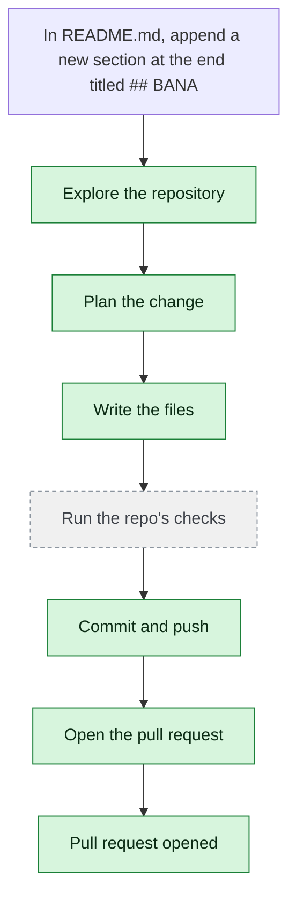

# yjoshi-wwt/example-three-tier-application — 2026-08-06

> In README.md, append a new section at the end titled "## BANANA" with the single line "Yellow fruit." Change nothing else.

| | |
| --- | --- |
| Job | `95f29001-139a-4dba-a28b-6119f2b88ae4` |
| Repository | [yjoshi-wwt/example-three-tier-application](https://github.com/yjoshi-wwt/example-three-tier-application) |
| Base branch | `devin/e2e-merge-test-base` |
| Work branch | [`agent/95f29001`](https://github.com/yjoshi-wwt/example-three-tier-application/tree/agent/95f29001) |
| Pull request | https://github.com/yjoshi-wwt/example-three-tier-application/pull/12 |
| Duration | 98.5s |

## How the run went

The agent was asked to work in **yjoshi-wwt/example-three-tier-application** from `devin/e2e-merge-test-base`. It began by exploring the repository rather than guessing: it opened 1 file(s) — `README.md`.

From what it read, it settled on 1 step(s):

1. **Append new BANANA section to README.md** — Add a new section at the end of README.md with the heading '## BANANA' followed by the line 'Yellow fruit.' on the next line.

It then wrote 2 file(s) — `README.md`, `README.md` — committing each to `agent/95f29001` as it went. Nothing was committed to the base branch: the only route there is the pull request.

The run ends at https://github.com/yjoshi-wwt/example-three-tier-application/pull/12, ready for review.

## The route it took

## Every step, in order

| # | Time | Step | What happened |
| --- | --- | --- | --- |
| 1 | 07:26:27 | `message` | Working in yjoshi-wwt/example-three-tier-application @ devin/e2e-merge-test-base |
| 2 | 07:26:27 | `state` | Agent state: planning |
| 3 | 07:26:29 | `run` | Listed / — 8 entries |
| 4 | 07:26:29 | `run` | Read README.md — `README.md` |
| 5 | 07:26:31 | `plan` | Append new BANANA section to README.md — `Add a new section at the end of README.md with the heading '## BANANA' followed by the line 'Yellow fruit.' on the next line.` |
| 6 | 07:26:32 | `commit` | Created branch agent/95f29001 |
| 7 | 07:26:32 | `state` | Agent state: executing |
| 8 | 07:26:33 | `run` | Read README.md — `README.md` |
| 9 | 07:26:43 | `edit` | Wrote README.md — `README.md` |
| 10 | 07:26:45 | `state` | Agent state: observing |
| 11 | 07:26:45 | `push` | Pushed 1 file(s) to agent/95f29001 |
| 12 | 07:26:48 | `pr` | Opened PR #12 — `https://github.com/yjoshi-wwt/example-three-tier-application/pull/12` |
| 13 | 07:26:59 | `build` | Build running (2 checks) — `https://github.com/yjoshi-wwt/example-three-tier-application/commit/08db3cfbbc63938419673bf1fc913fdab44cae2c/checks` |
| 14 | 07:27:19 | `build` | Build failed — forbid — `https://github.com/yjoshi-wwt/example-three-tier-application/commit/08db3cfbbc63938419673bf1fc913fdab44cae2c/checks` |
| 15 | 07:27:20 | `message` | Fixing the build (forbid) (attempt 1) |
| 16 | 07:27:20 | `state` | Agent state: executing |
| 17 | 07:27:22 | `run` | Read README.md — `README.md` |
| 18 | 07:27:33 | `edit` | Wrote README.md — `README.md` |
| 19 | 07:27:34 | `state` | Agent state: observing |
| 20 | 07:27:45 | `build` | Build running (2 checks) — `https://github.com/yjoshi-wwt/example-three-tier-application/commit/c0525808f5e7c2dfe0d2dbf2666cabfab05a85dc/checks` |
| 21 | 07:28:05 | `build` | Build passed (2 checks) — `https://github.com/yjoshi-wwt/example-three-tier-application/commit/c0525808f5e7c2dfe0d2dbf2666cabfab05a85dc/checks` |

---

_Generated by the FORGE code agent. Each interaction gets its own file in `docs/runs/`._