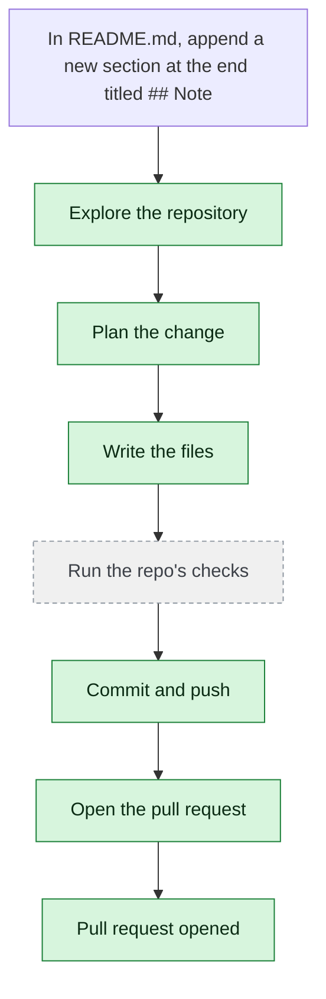

# yjoshi-wwt/example-three-tier-application — 2026-08-06

> In README.md, append a new section at the end titled "## Notes" with the single line "Build status cards are live." Change nothing else.

| | |
| --- | --- |
| Job | `b8c6e116-c943-434f-82a6-3b53cec0c88f` |
| Repository | [yjoshi-wwt/example-three-tier-application](https://github.com/yjoshi-wwt/example-three-tier-application) |
| Base branch | `devin/e2e-merge-test-base` |
| Work branch | [`agent/b8c6e116`](https://github.com/yjoshi-wwt/example-three-tier-application/tree/agent/b8c6e116) |
| Pull request | https://github.com/yjoshi-wwt/example-three-tier-application/pull/10 |
| Duration | 153.0s |

## How the run went

The agent was asked to work in **yjoshi-wwt/example-three-tier-application** from `devin/e2e-merge-test-base`. It began by exploring the repository rather than guessing: it opened 1 file(s) — `README.md`.

From what it read, it settled on 1 step(s):

1. **Append Notes section to README.md** — Add a new section at the end of README.md with the heading '## Notes' followed by the line 'Build status cards are live.'

It then wrote 1 file(s) — `README.md` — committing each to `agent/b8c6e116` as it went. Nothing was committed to the base branch: the only route there is the pull request.

Things that went wrong along the way: **git_diff failed**.

The run ends at https://github.com/yjoshi-wwt/example-three-tier-application/pull/10, ready for review.

## The route it took

## Every step, in order

| # | Time | Step | What happened |
| --- | --- | --- | --- |
| 1 | 07:19:21 | `message` | Working in yjoshi-wwt/example-three-tier-application @ devin/e2e-merge-test-base |
| 2 | 07:19:22 | `state` | Agent state: planning |
| 3 | 07:19:23 | `run` | Listed / — 7 entries |
| 4 | 07:19:24 | `run` | Read README.md — `README.md` |
| 5 | 07:19:25 | `plan` | Append Notes section to README.md — `Add a new section at the end of README.md with the heading '## Notes' followed by the line 'Build status cards are live.'` |
| 6 | 07:19:26 | `commit` | Created branch agent/b8c6e116 |
| 7 | 07:19:26 | `state` | Agent state: executing |
| 8 | 07:19:28 | `run` | Read README.md — `README.md` |
| 9 | 07:19:37 | `edit` | Wrote README.md — `README.md` |
| 10 | 07:19:38 | `error` | git_diff failed — `Diffing agent/b8c6e116 needs a sandbox on this deploy.` |
| 11 | 07:19:39 | `state` | Agent state: observing |
| 12 | 07:19:39 | `push` | Pushed 1 file(s) to agent/b8c6e116 |
| 13 | 07:19:42 | `pr` | Opened PR #10 — `https://github.com/yjoshi-wwt/example-three-tier-application/pull/10` |
| 14 | 07:21:54 | `build` | No checks reported for this commit — `https://github.com/yjoshi-wwt/example-three-tier-application/commit/f4b763e4951301e211b7647e052c86cb6fa640dd/checks` |

---

_Generated by the FORGE code agent. Each interaction gets its own file in `docs/runs/`._