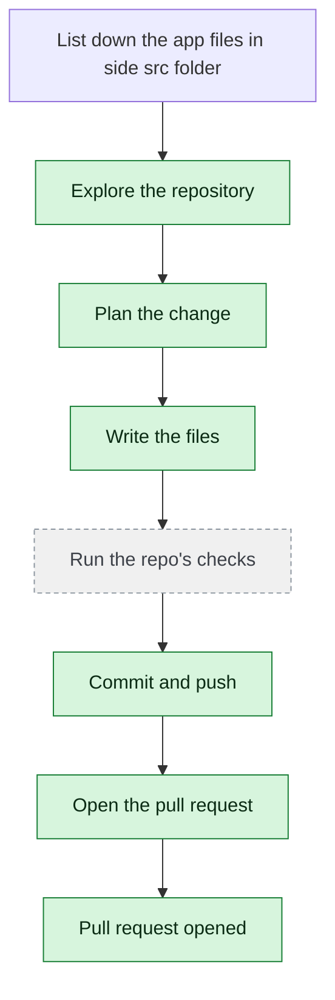

# yjoshi-wwt/example-three-tier-application — 2026-08-06

> List down the app files in side src folder

| | |
| --- | --- |
| Job | `ca933f0b-86bb-45fb-abc3-6892845dc632` |
| Repository | [yjoshi-wwt/example-three-tier-application](https://github.com/yjoshi-wwt/example-three-tier-application) |
| Base branch | `agent/2c034f08` |
| Work branch | [`agent/ca933f0b`](https://github.com/yjoshi-wwt/example-three-tier-application/tree/agent/ca933f0b) |
| Pull request | https://github.com/yjoshi-wwt/example-three-tier-application/pull/9 |
| Duration | 95.2s |
| Logs | [CloudWatch Logs Insights](https://us-east-1.console.aws.amazon.com/cloudwatch/home?region=us-east-1#logsV2:logs-insights?queryDetail=~(end~'2026-08-06T06%3A00%3A32.617Z~start~'2026-08-06T05%3A56%3A57.409Z~timeType~'ABSOLUTE~tz~'UTC~editorString~'fields*20*40timestamp*2C*20level*2C*20msg*2C*20jobId*0A*7C*20filter*20jobId*20*3D*20'ca933f0b-86bb-45fb-abc3-6892845dc632'*20or*20*40message*20like*20'ca933f0b-86bb-45fb-abc3-6892845dc632'*0A*7C*20sort*20*40timestamp*20asc*0A*7C*20limit*20500~source~(~'*2Faine-forge*2Forchestrator))) |

## How the run went

The agent was asked to work in **yjoshi-wwt/example-three-tier-application** from `agent/2c034f08`. It began by exploring the repository rather than guessing: it opened 22 file(s) — `src/api/index.js`, `src/api/db.js`, `src/api/package.json`, `src/api/Dockerfile`, `src/db/package.json`, `src/db/Dockerfile`, `src/db/migrations/1718500000000_initial-schema.js`, `src/db/migrations/1718500001000_create-tasks.js`, among others.

From what it read, it settled on 5 step(s):

1. **Document API layer files** — List and document all files in src/api including index.js, db.js, package.json, Dockerfile, and configuration files.
1. **Document database layer files** — List and document all files in src/db including package.json, Dockerfile, and migration files in src/db/migrations.
1. **Document web/frontend layer files** — List and document all files in src/web including configuration files (tsconfig.json, next.config.ts, eslint.config.mjs, postcss.config.mjs) and app directory contents.
1. **Document Next.js app components** — List and document all component files in src/web/app including layout.tsx, page.tsx, actions.ts, globals.css, and favicon.ico.
1. **Document infrastructure files** — List and document all Terraform files in src/infrastructure including main.tf, migration.tf, variables.tf, outputs.tf, and terraform.tfvars.example.

It then wrote 1 file(s) — `SRC_FILES_DOCUMENTATION.md` — committing each to `agent/ca933f0b` as it went. Nothing was committed to the base branch: the only route there is the pull request.

The run ends at https://github.com/yjoshi-wwt/example-three-tier-application/pull/9, ready for review.

## The route it took

## Every step, in order

| # | Time | Step | What happened |
| --- | --- | --- | --- |
| 1 | 05:57:57 | `message` | Working in yjoshi-wwt/example-three-tier-application @ agent/2c034f08 |
| 2 | 05:57:58 | `state` | Agent state: planning |
| 3 | 05:58:00 | `run` | Listed / — 8 entries |
| 4 | 05:58:02 | `run` | Listed src — 4 entries — `src` |
| 5 | 05:58:04 | `run` | Listed src/api — 6 entries — `src/api` |
| 6 | 05:58:05 | `run` | Listed src/db — 5 entries — `src/db` |
| 7 | 05:58:05 | `run` | Listed src/infrastructure — 6 entries — `src/infrastructure` |
| 8 | 05:58:06 | `run` | Listed src/web — 14 entries — `src/web` |
| 9 | 05:58:08 | `run` | Listed src/web/app — 5 entries — `src/web/app` |
| 10 | 05:58:08 | `run` | Listed src/db/migrations — 2 entries — `src/db/migrations` |
| 11 | 05:58:15 | `plan` | Document API layer files — `List and document all files in src/api including index.js, db.js, package.json, Dockerfile, and configuration files.` |
| 12 | 05:58:15 | `plan` | Document database layer files — `List and document all files in src/db including package.json, Dockerfile, and migration files in src/db/migrations.` |
| 13 | 05:58:15 | `plan` | Document web/frontend layer files — `List and document all files in src/web including configuration files (tsconfig.json, next.config.ts, eslint.config.mjs, postcss.config.mjs) and app directory co` |
| 14 | 05:58:15 | `plan` | Document Next.js app components — `List and document all component files in src/web/app including layout.tsx, page.tsx, actions.ts, globals.css, and favicon.ico.` |
| 15 | 05:58:15 | `plan` | Document infrastructure files — `List and document all Terraform files in src/infrastructure including main.tf, migration.tf, variables.tf, outputs.tf, and terraform.tfvars.example.` |
| 16 | 05:58:17 | `commit` | Created branch agent/ca933f0b |
| 17 | 05:58:17 | `state` | Agent state: executing |
| 18 | 05:58:24 | `run` | Ran find src -type f -name '*.js' -o -name '*.ts' -o -name '*.tsx' -o -name '*.json' -o -name Dockerfile -o -name '*.tf' -o -name '*.css' -o -name '*.mjs' -o -name '*.ico' — `find src -type f -name "*.js" -o -name "*.ts" -o -name "*.tsx" -o -name "*.json" -o -name "Dockerfile" -o -name "*.tf" -o -name "*.css" -o -name "*.mjs" -o -nam` |
| 19 | 05:58:29 | `run` | Read src/api/index.js — `src/api/index.js` |
| 20 | 05:58:30 | `run` | Read src/api/db.js — `src/api/db.js` |
| 21 | 05:58:31 | `run` | Read src/api/package.json — `src/api/package.json` |
| 22 | 05:58:31 | `run` | Read src/api/Dockerfile — `src/api/Dockerfile` |
| 23 | 05:58:32 | `run` | Read src/db/package.json — `src/db/package.json` |
| 24 | 05:58:33 | `run` | Read src/db/Dockerfile — `src/db/Dockerfile` |
| 25 | 05:58:33 | `run` | Read src/db/migrations/1718500000000_initial-schema.js — `src/db/migrations/1718500000000_initial-schema.js` |
| 26 | 05:58:34 | `run` | Read src/db/migrations/1718500001000_create-tasks.js — `src/db/migrations/1718500001000_create-tasks.js` |
| 27 | 05:58:34 | `run` | Read src/web/package.json — `src/web/package.json` |
| 28 | 05:58:35 | `run` | Read src/web/tsconfig.json — `src/web/tsconfig.json` |
| 29 | 05:58:36 | `run` | Read src/web/next.config.ts — `src/web/next.config.ts` |
| 30 | 05:58:36 | `run` | Read src/web/eslint.config.mjs — `src/web/eslint.config.mjs` |
| 31 | 05:58:37 | `run` | Read src/web/postcss.config.mjs — `src/web/postcss.config.mjs` |
| 32 | 05:58:37 | `run` | Read src/web/Dockerfile — `src/web/Dockerfile` |
| 33 | 05:58:38 | `run` | Read src/web/app/layout.tsx — `src/web/app/layout.tsx` |
| 34 | 05:58:39 | `run` | Read src/web/app/page.tsx — `src/web/app/page.tsx` |
| 35 | 05:58:39 | `run` | Read src/web/app/actions.ts — `src/web/app/actions.ts` |
| 36 | 05:58:40 | `run` | Read src/web/app/globals.css — `src/web/app/globals.css` |
| 37 | 05:58:41 | `run` | Read src/infrastructure/main.tf — `src/infrastructure/main.tf` |
| 38 | 05:58:41 | `run` | Read src/infrastructure/migration.tf — `src/infrastructure/migration.tf` |
| 39 | 05:58:42 | `run` | Read src/infrastructure/variables.tf — `src/infrastructure/variables.tf` |
| 40 | 05:58:43 | `run` | Read src/infrastructure/outputs.tf — `src/infrastructure/outputs.tf` |
| 41 | 05:59:13 | `edit` | Wrote SRC_FILES_DOCUMENTATION.md — `SRC_FILES_DOCUMENTATION.md` |
| 42 | 05:59:16 | `run` | git status — 1 file(s) changed |
| 43 | 05:59:22 | `run` | Committed 4ceb9a9 |
| 44 | 05:59:27 | `state` | Agent state: observing |
| 45 | 05:59:27 | `push` | Pushed 1 file(s) to agent/ca933f0b |
| 46 | 05:59:32 | `pr` | Opened PR #9 — `https://github.com/yjoshi-wwt/example-three-tier-application/pull/9` |

---

_Generated by the FORGE code agent. Each interaction gets its own file in `docs/runs/`._