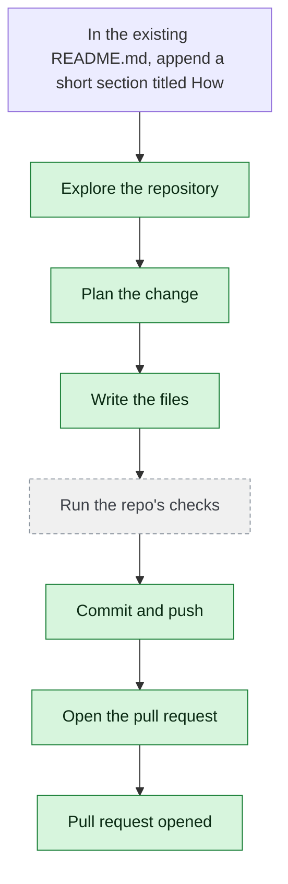

# yjoshi-wwt/example-three-tier-application — 2026-08-15

> In the existing README.md, append a short section titled 'How to run the tests' describing the test commands. Modify only README.md.

| | |
| --- | --- |
| Job | `12f09cc9-a123-4852-9624-f41f089cfa60` |
| Repository | [yjoshi-wwt/example-three-tier-application](https://github.com/yjoshi-wwt/example-three-tier-application) |
| Base branch | `main` |
| Work branch | [`agent/12f09cc9`](https://github.com/yjoshi-wwt/example-three-tier-application/tree/agent/12f09cc9) |
| Pull request | https://github.com/yjoshi-wwt/example-three-tier-application/pull/16 |
| Duration | 61.6s |
| Logs | [CloudWatch Logs Insights](https://us-east-1.console.aws.amazon.com/cloudwatch/home?region=us-east-1#logsV2:logs-insights?queryDetail=~(end~'2026-08-15T11%3A06%3A49.916Z~start~'2026-08-15T11%3A03%3A48.268Z~timeType~'ABSOLUTE~tz~'UTC~editorString~'fields*20*40timestamp*2C*20level*2C*20msg*2C*20jobId*0A*7C*20filter*20jobId*20*3D*20'12f09cc9-a123-4852-9624-f41f089cfa60'*20or*20*40message*20like*20'12f09cc9-a123-4852-9624-f41f089cfa60'*0A*7C*20sort*20*40timestamp*20asc*0A*7C*20limit*20500~source~(~'*2Faine-forge*2Forchestrator))) |

## How the run went

The agent was asked to work in **yjoshi-wwt/example-three-tier-application** from `main`. It began by exploring the repository rather than guessing: it opened 4 file(s) — `README.md`, `src/api/package.json`, `src/web/package.json`, `.github/workflows/deploy.yml`.

From what it read, it settled on 1 step(s):

1. **Append 'How to run the tests' section to README.md** — Add a new section at the end of README.md describing the available test commands for the API and web layers, including the lint command for the frontend and noting that the API currently has no tests configured.

It then wrote 1 file(s) — `README.md` — committing each to `agent/12f09cc9` as it went. Nothing was committed to the base branch: the only route there is the pull request.

The run ends at https://github.com/yjoshi-wwt/example-three-tier-application/pull/16, ready for review.

## The route it took

## Every step, in order

| # | Time | Step | What happened |
| --- | --- | --- | --- |
| 1 | 11:04:48 | `message` | Working in yjoshi-wwt/example-three-tier-application @ main |
| 2 | 11:04:48 | `message` | Pinned to global.anthropic.claude-haiku-4-5-20251001-v1:0 by BEDROCK_MODEL_ID |
| 3 | 11:04:48 | `message` | Running this in a single pass — this is one contained change; checking its work and fixing what breaks |
| 4 | 11:04:48 | `run` | Read 2 wiki page(s) for context |
| 5 | 11:04:49 | `state` | Agent state: planning |
| 6 | 11:04:52 | `run` | Listed / — 7 entries |
| 7 | 11:04:53 | `run` | Read README.md — `README.md` |
| 8 | 11:04:55 | `run` | Listed src — 4 entries — `src` |
| 9 | 11:04:56 | `run` | Listed src/api — 6 entries — `src/api` |
| 10 | 11:04:56 | `run` | Listed src/web — 14 entries — `src/web` |
| 11 | 11:04:59 | `run` | Read src/api/package.json — `src/api/package.json` |
| 12 | 11:04:59 | `run` | Read src/web/package.json — `src/web/package.json` |
| 13 | 11:05:02 | `run` | Listed .github — 1 entries — `.github` |
| 14 | 11:05:04 | `run` | Listed .github/workflows — 1 entries — `.github/workflows` |
| 15 | 11:05:06 | `run` | Read .github/workflows/deploy.yml — `.github/workflows/deploy.yml` |
| 16 | 11:05:08 | `run` | No wiki pages match "test commands testing" |
| 17 | 11:05:12 | `plan` | Append 'How to run the tests' section to README.md — `Add a new section at the end of README.md describing the available test commands for the API and web layers, including the lint command for the frontend and not` |
| 18 | 11:05:14 | `commit` | Created branch agent/12f09cc9 |
| 19 | 11:05:14 | `state` | Agent state: executing |
| 20 | 11:05:18 | `run` | Read README.md — `README.md` |
| 21 | 11:05:22 | `run` | Read src/api/package.json — `src/api/package.json` |
| 22 | 11:05:22 | `run` | Read src/web/package.json — `src/web/package.json` |
| 23 | 11:05:34 | `edit` | Wrote README.md — `README.md` |
| 24 | 11:05:36 | `run` | git diff |
| 25 | 11:05:41 | `run` | Committed b3c6c8d |
| 26 | 11:05:43 | `run` | git status — clean |
| 27 | 11:05:46 | `state` | Agent state: observing |
| 28 | 11:05:47 | `push` | Pushed 1 file(s) to agent/12f09cc9 |
| 29 | 11:05:49 | `pr` | Opened PR #16 — `https://github.com/yjoshi-wwt/example-three-tier-application/pull/16` |

---

_Generated by the FORGE code agent. Each interaction gets its own file in `docs/runs/`._