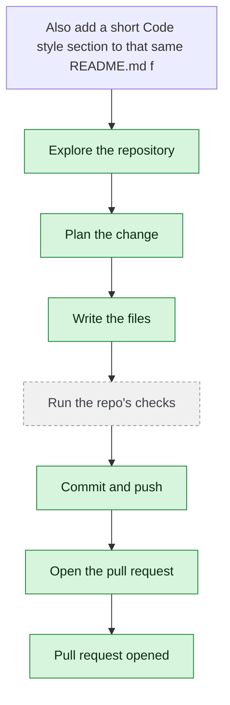

# yjoshi-wwt/example-three-tier-application — 2026-08-15

> Also add a short 'Code style' section to that same README.md file.

| | |
| --- | --- |
| Job | `715877fb-1234-49a8-8549-777f53c130b9` |
| Repository | [yjoshi-wwt/example-three-tier-application](https://github.com/yjoshi-wwt/example-three-tier-application) |
| Base branch | `main` |
| Work branch | [`agent/12f09cc9`](https://github.com/yjoshi-wwt/example-three-tier-application/tree/agent/12f09cc9) |
| Pull request | https://github.com/yjoshi-wwt/example-three-tier-application/pull/16 |
| Duration | 51.2s |
| Logs | [CloudWatch Logs Insights](https://us-east-1.console.aws.amazon.com/cloudwatch/home?region=us-east-1#logsV2:logs-insights?queryDetail=~(end~'2026-08-15T11%3A10%3A37.052Z~start~'2026-08-15T11%3A07%3A45.808Z~timeType~'ABSOLUTE~tz~'UTC~editorString~'fields*20*40timestamp*2C*20level*2C*20msg*2C*20jobId*0A*7C*20filter*20jobId*20*3D*20'715877fb-1234-49a8-8549-777f53c130b9'*20or*20*40message*20like*20'715877fb-1234-49a8-8549-777f53c130b9'*0A*7C*20sort*20*40timestamp*20asc*0A*7C*20limit*20500~source~(~'*2Faine-forge*2Forchestrator))) |

## How the run went

The agent was asked to work in **yjoshi-wwt/example-three-tier-application** from `main`. It began by exploring the repository rather than guessing: it opened 6 file(s) — `README.md`, `src/web/package.json`, `src/api/package.json`, `src/web/eslint.config.mjs`, `src/api/index.js`, `src/web/app/page.tsx`.

From what it read, it settled on 1 step(s):

1. **Add 'Code style' section to README.md** — Append a new 'Code style' section after the 'How to run the tests' section in README.md that documents the linting setup for the frontend (ESLint with Next.js config), the JavaScript style for the API (CommonJS, simple Express patterns), and general conventions like inline comments explaining the 'why' of the code.

It then wrote 1 file(s) — `README.md` — committing each to `agent/12f09cc9` as it went. Nothing was committed to the base branch: the only route there is the pull request.

The run ends at https://github.com/yjoshi-wwt/example-three-tier-application/pull/16, ready for review.

## The route it took

## Every step, in order

| # | Time | Step | What happened |
| --- | --- | --- | --- |
| 1 | 11:08:45 | `message` | Continuing 12f09cc9 on agent/12f09cc9 |
| 2 | 11:08:45 | `message` | Pinned to global.anthropic.claude-haiku-4-5-20251001-v1:0 by BEDROCK_MODEL_ID |
| 3 | 11:08:45 | `message` | Planning and re-planning as it goes — it continues a paused run; skipping the checks — no code to break, committing every 120s |
| 4 | 11:08:45 | `run` | Read 2 wiki page(s) for context |
| 5 | 11:08:46 | `state` | Agent state: planning |
| 6 | 11:08:49 | `run` | Read README.md — `README.md` |
| 7 | 11:08:52 | `run` | Listed src/web — 14 entries — `src/web` |
| 8 | 11:08:52 | `run` | Listed src/api — 6 entries — `src/api` |
| 9 | 11:08:53 | `run` | Read src/web/package.json — `src/web/package.json` |
| 10 | 11:08:53 | `run` | Read src/api/package.json — `src/api/package.json` |
| 11 | 11:08:56 | `run` | Read src/web/eslint.config.mjs — `src/web/eslint.config.mjs` |
| 12 | 11:08:57 | `run` | Read src/api/index.js — `src/api/index.js` |
| 13 | 11:08:57 | `run` | Read src/web/app/page.tsx — `src/web/app/page.tsx` |
| 14 | 11:09:02 | `plan` | Add 'Code style' section to README.md — `Append a new 'Code style' section after the 'How to run the tests' section in README.md that documents the linting setup for the frontend (ESLint with Next.js c` |
| 15 | 11:09:02 | `commit` | Continuing on branch agent/12f09cc9 |
| 16 | 11:09:02 | `state` | Agent state: executing |
| 17 | 11:09:07 | `run` | Read README.md — `README.md` |
| 18 | 11:09:19 | `edit` | Wrote README.md — `README.md` |
| 19 | 11:09:21 | `run` | git diff |
| 20 | 11:09:26 | `run` | Committed 1d9de89 |
| 21 | 11:09:30 | `pr` | Opened PR #16 — `https://github.com/yjoshi-wwt/example-three-tier-application/pull/16` |
| 22 | 11:09:33 | `push` | Pushed 1 file(s) to agent/12f09cc9 |
| 23 | 11:09:34 | `state` | Agent state: observing |
| 24 | 11:09:37 | `pr` | Opened PR #16 — `https://github.com/yjoshi-wwt/example-three-tier-application/pull/16` |

---

_Generated by the FORGE code agent. Each interaction gets its own file in `docs/runs/`._