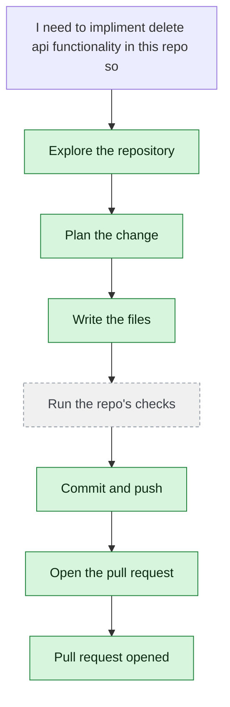

# yjoshi-wwt/example-three-tier-application — 2026-08-15

> I need to impliment delete api functionality in this repo so create a branch and do it and then share me the branch details

| | |
| --- | --- |
| Job | `7365d46c-21a8-4985-8a74-e14d924d3a91` |
| Repository | [yjoshi-wwt/example-three-tier-application](https://github.com/yjoshi-wwt/example-three-tier-application) |
| Base branch | `main` |
| Work branch | [`agent/7365d46c`](https://github.com/yjoshi-wwt/example-three-tier-application/tree/agent/7365d46c) |
| Pull request | https://github.com/yjoshi-wwt/example-three-tier-application/pull/17 |
| Duration | 93.3s |
| Logs | [CloudWatch Logs Insights](https://us-east-1.console.aws.amazon.com/cloudwatch/home?region=us-east-1#logsV2:logs-insights?queryDetail=~(end~'2026-08-15T11%3A14%3A34.060Z~start~'2026-08-15T11%3A11%3A00.740Z~timeType~'ABSOLUTE~tz~'UTC~editorString~'fields*20*40timestamp*2C*20level*2C*20msg*2C*20jobId*0A*7C*20filter*20jobId*20*3D*20'7365d46c-21a8-4985-8a74-e14d924d3a91'*20or*20*40message*20like*20'7365d46c-21a8-4985-8a74-e14d924d3a91'*0A*7C*20sort*20*40timestamp*20asc*0A*7C*20limit*20500~source~(~'*2Faine-forge*2Forchestrator))) |

## How the run went

The agent was asked to work in **yjoshi-wwt/example-three-tier-application** from `main`. It began by exploring the repository rather than guessing: it opened 4 file(s) — `src/api/index.js`, `src/web/app/actions.ts`, `src/web/app/page.tsx`, `src/db/migrations/1718500001000_create-tasks.js`.

From what it read, it settled on 3 step(s):

1. **Add DELETE endpoint to the Express API** — Add a DELETE /tasks/:id route handler in src/api/index.js that deletes a task by ID and returns 204 No Content on success, or 404 if not found.
1. **Add deleteTask server action to the frontend** — Add a new deleteTask async function in src/web/app/actions.ts that calls the DELETE /tasks/:id endpoint and revalidates the path.
1. **Add delete button to the task list UI** — Update src/web/app/page.tsx to add a delete button next to each task that calls the deleteTask action with proper styling and accessibility.

It then wrote 3 file(s) — `src/api/index.js`, `src/web/app/actions.ts`, `src/web/app/page.tsx` — committing each to `agent/7365d46c` as it went. Nothing was committed to the base branch: the only route there is the pull request.

Things that went wrong along the way: **Command refused**.

The run ends at https://github.com/yjoshi-wwt/example-three-tier-application/pull/17, ready for review.

## The route it took

## Every step, in order

| # | Time | Step | What happened |
| --- | --- | --- | --- |
| 1 | 11:12:00 | `message` | Working in yjoshi-wwt/example-three-tier-application @ main |
| 2 | 11:12:00 | `message` | Pinned to global.anthropic.claude-haiku-4-5-20251001-v1:0 by BEDROCK_MODEL_ID |
| 3 | 11:12:00 | `message` | Planning and re-planning as it goes — the task has several steps; checking its work and fixing what breaks, committing every 120s |
| 4 | 11:12:00 | `run` | Read 2 wiki page(s) for context |
| 5 | 11:12:01 | `state` | Agent state: planning |
| 6 | 11:12:04 | `run` | Listed / — 7 entries |
| 7 | 11:12:04 | `run` | Read src/api/index.js — `src/api/index.js` |
| 8 | 11:12:05 | `run` | Read src/web/app/actions.ts — `src/web/app/actions.ts` |
| 9 | 11:12:08 | `run` | Read src/web/app/page.tsx — `src/web/app/page.tsx` |
| 10 | 11:12:08 | `run` | Listed src/db — 5 entries — `src/db` |
| 11 | 11:12:10 | `run` | Listed src/db/migrations — 2 entries — `src/db/migrations` |
| 12 | 11:12:13 | `run` | Read src/db/migrations/1718500001000_create-tasks.js — `src/db/migrations/1718500001000_create-tasks.js` |
| 13 | 11:12:19 | `plan` | Add DELETE endpoint to the Express API — `Add a DELETE /tasks/:id route handler in src/api/index.js that deletes a task by ID and returns 204 No Content on success, or 404 if not found.` |
| 14 | 11:12:19 | `plan` | Add deleteTask server action to the frontend — `Add a new deleteTask async function in src/web/app/actions.ts that calls the DELETE /tasks/:id endpoint and revalidates the path.` |
| 15 | 11:12:19 | `plan` | Add delete button to the task list UI — `Update src/web/app/page.tsx to add a delete button next to each task that calls the deleteTask action with proper styling and accessibility.` |
| 16 | 11:12:20 | `commit` | Created branch agent/7365d46c |
| 17 | 11:12:20 | `state` | Agent state: executing |
| 18 | 11:12:26 | `run` | Read src/api/index.js — `src/api/index.js` |
| 19 | 11:12:26 | `run` | Read src/web/app/actions.ts — `src/web/app/actions.ts` |
| 20 | 11:12:27 | `run` | Read src/web/app/page.tsx — `src/web/app/page.tsx` |
| 21 | 11:12:33 | `edit` | Wrote src/api/index.js — `src/api/index.js` |
| 22 | 11:12:36 | `edit` | Wrote src/web/app/actions.ts — `src/web/app/actions.ts` |
| 23 | 11:12:45 | `edit` | Wrote src/web/app/page.tsx — `src/web/app/page.tsx` |
| 24 | 11:12:48 | `run` | git status — 3 file(s) changed |
| 25 | 11:12:50 | `run` | git diff |
| 26 | 11:12:56 | `run` | Committed 5d7d216 |
| 27 | 11:13:02 | `pr` | Opened PR #17 — `https://github.com/yjoshi-wwt/example-three-tier-application/pull/17` |
| 28 | 11:13:04 | `run` | Ran git log --oneline -1 — `git log --oneline -1` |
| 29 | 11:13:07 | `error` | Command refused — `Refused: git branch is not read-only. Through execute_command git may only run status, diff, log, show, ls-files; use git_commit and git_push for the write side` |
| 30 | 11:13:10 | `run` | Ran git log --oneline -5 — `git log --oneline -5` |
| 31 | 11:13:12 | `run` | Already published |
| 32 | 11:13:14 | `run` | Ran git log --oneline -3 — `git log --oneline -3` |
| 33 | 11:13:17 | `run` | git status — clean |
| 34 | 11:13:20 | `run` | Nothing to commit |
| 35 | 11:13:22 | `run` | git diff |
| 36 | 11:13:29 | `state` | Agent state: observing |
| 37 | 11:13:29 | `push` | Pushed 3 file(s) to agent/7365d46c |
| 38 | 11:13:34 | `pr` | Opened PR #17 — `https://github.com/yjoshi-wwt/example-three-tier-application/pull/17` |

---

_Generated by the FORGE code agent. Each interaction gets its own file in `docs/runs/`._