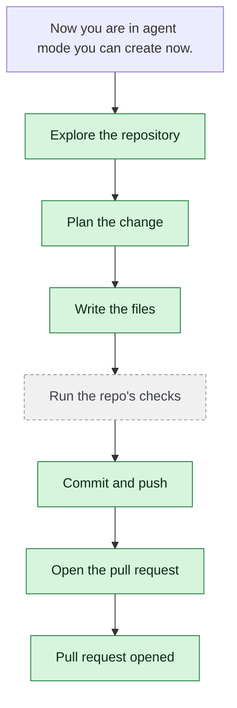

# yjoshi-wwt/example-three-tier-application — 2026-08-15

> Now you are in agent mode you can create now.

| | |
| --- | --- |
| Job | `7b12d5d7-d475-4a8f-a5c8-fbfca913bedb` |
| Repository | [yjoshi-wwt/example-three-tier-application](https://github.com/yjoshi-wwt/example-three-tier-application) |
| Base branch | `agent/e90b27c3` |
| Work branch | [`agent/7b12d5d7`](https://github.com/yjoshi-wwt/example-three-tier-application/tree/agent/7b12d5d7) |
| Pull request | https://github.com/yjoshi-wwt/example-three-tier-application/pull/18 |
| Duration | 78.0s |
| Logs | [CloudWatch Logs Insights](https://us-east-1.console.aws.amazon.com/cloudwatch/home?region=us-east-1#logsV2:logs-insights?queryDetail=~(end~'2026-08-15T11%3A39%3A31.053Z~start~'2026-08-15T11%3A36%3A13.102Z~timeType~'ABSOLUTE~tz~'UTC~editorString~'fields*20*40timestamp*2C*20level*2C*20msg*2C*20jobId*0A*7C*20filter*20jobId*20*3D*20'7b12d5d7-d475-4a8f-a5c8-fbfca913bedb'*20or*20*40message*20like*20'7b12d5d7-d475-4a8f-a5c8-fbfca913bedb'*0A*7C*20sort*20*40timestamp*20asc*0A*7C*20limit*20500~source~(~'*2Faine-forge*2Forchestrator))) |

## How the run went

The agent was asked to work in **yjoshi-wwt/example-three-tier-application** from `agent/e90b27c3`. It began by exploring the repository rather than guessing: it opened 9 file(s) — `agents.md`, `README.md`, `docs/runs/2026-08-07-e90b27c3.md`, `src/web/app/layout.tsx`, `src/api/index.js`, `src/web/app/actions.ts`, `.env.example`, `src/db/migrations/1718500000000_initial-schema.js`, among others.

From what it read, it settled on 1 step(s):

1. **Add a delete button to the task list UI** — Update src/web/app/page.tsx to add a delete button next to each task that calls the deleteTask server action, with appropriate styling and error handling.

It then wrote 1 file(s) — `src/web/app/page.tsx` — committing each to `agent/7b12d5d7` as it went. Nothing was committed to the base branch: the only route there is the pull request.

The run ends at https://github.com/yjoshi-wwt/example-three-tier-application/pull/18, ready for review.

## The route it took

## Every step, in order

| # | Time | Step | What happened |
| --- | --- | --- | --- |
| 1 | 11:37:13 | `message` | Working in yjoshi-wwt/example-three-tier-application @ agent/e90b27c3 |
| 2 | 11:37:13 | `message` | Pinned to global.anthropic.claude-haiku-4-5-20251001-v1:0 by BEDROCK_MODEL_ID |
| 3 | 11:37:13 | `message` | Running this in a single pass — this is one contained change; checking its work and fixing what breaks |
| 4 | 11:37:13 | `run` | Read 3 wiki page(s) for context |
| 5 | 11:37:13 | `state` | Agent state: planning |
| 6 | 11:37:15 | `run` | Listed / — 9 entries |
| 7 | 11:37:15 | `run` | No wiki pages match "agent mode create task" |
| 8 | 11:37:18 | `run` | Read agents.md — `agents.md` |
| 9 | 11:37:22 | `run` | Read README.md — `README.md` |
| 10 | 11:37:22 | `run` | Listed src — 4 entries — `src` |
| 11 | 11:37:24 | `run` | No wiki pages match "branch agent e90b27c3" |
| 12 | 11:37:24 | `run` | Listed .github — 1 entries — `.github` |
| 13 | 11:37:27 | `run` | Listed docs — 1 entries — `docs` |
| 14 | 11:37:29 | `run` | Listed docs/runs — 1 entries — `docs/runs` |
| 15 | 11:37:32 | `run` | Read docs/runs/2026-08-07-e90b27c3.md — `docs/runs/2026-08-07-e90b27c3.md` |
| 16 | 11:37:37 | `run` | Read src/web/app/layout.tsx — `src/web/app/layout.tsx` |
| 17 | 11:37:38 | `run` | Read src/api/index.js — `src/api/index.js` |
| 18 | 11:37:39 | `run` | Read src/web/app/actions.ts — `src/web/app/actions.ts` |
| 19 | 11:37:39 | `run` | Read .env.example — `.env.example` |
| 20 | 11:37:43 | `run` | Read src/db/migrations/1718500000000_initial-schema.js — `src/db/migrations/1718500000000_initial-schema.js` |
| 21 | 11:37:46 | `run` | Read src/web/app/page.tsx — `src/web/app/page.tsx` |
| 22 | 11:37:51 | `plan` | Add a delete button to the task list UI — `Update src/web/app/page.tsx to add a delete button next to each task that calls the deleteTask server action, with appropriate styling and error handling.` |
| 23 | 11:37:53 | `commit` | Created branch agent/7b12d5d7 |
| 24 | 11:37:53 | `state` | Agent state: executing |
| 25 | 11:37:58 | `run` | Read src/web/app/page.tsx — `src/web/app/page.tsx` |
| 26 | 11:37:59 | `run` | Read src/web/app/actions.ts — `src/web/app/actions.ts` |
| 27 | 11:38:02 | `run` | Read src/api/index.js — `src/api/index.js` |
| 28 | 11:38:11 | `edit` | Wrote src/web/app/page.tsx — `src/web/app/page.tsx` |
| 29 | 11:38:13 | `run` | git diff |
| 30 | 11:38:18 | `run` | Committed d9d5899 |
| 31 | 11:38:21 | `pr` | Opened PR #18 — `https://github.com/yjoshi-wwt/example-three-tier-application/pull/18` |
| 32 | 11:38:23 | `run` | git status — clean |
| 33 | 11:38:28 | `state` | Agent state: observing |
| 34 | 11:38:28 | `push` | Pushed 1 file(s) to agent/7b12d5d7 |
| 35 | 11:38:31 | `pr` | Opened PR #18 — `https://github.com/yjoshi-wwt/example-three-tier-application/pull/18` |

---

_Generated by the FORGE code agent. Each interaction gets its own file in `docs/runs/`._