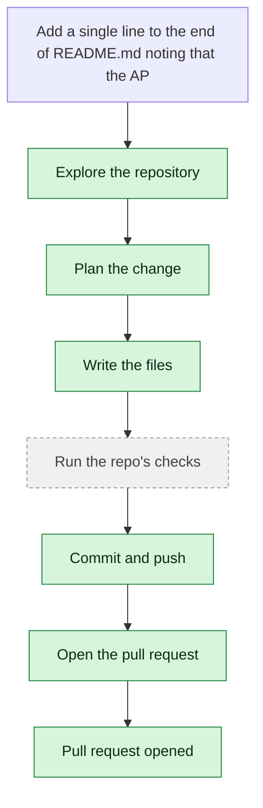

# yjoshi-wwt/example-three-tier-application — 2026-08-15

> Add a single line to the end of README.md noting that the API database connection is configured in src/api/db.js. Change nothing else.

| | |
| --- | --- |
| Job | `9f78b400-9721-4534-9152-70d9ca2bee91` |
| Repository | [yjoshi-wwt/example-three-tier-application](https://github.com/yjoshi-wwt/example-three-tier-application) |
| Base branch | `main` |
| Work branch | [`agent/9f78b400`](https://github.com/yjoshi-wwt/example-three-tier-application/tree/agent/9f78b400) |
| Pull request | https://github.com/yjoshi-wwt/example-three-tier-application/pull/15 |
| Duration | 28.2s |

## How the run went

The agent was asked to work in **yjoshi-wwt/example-three-tier-application** from `main`. It began by exploring the repository rather than guessing: it opened 2 file(s) — `README.md`, `src/api/db.js`.

From what it read, it settled on 1 step(s):

1. **Add database connection configuration note to README.md** — Append a single line to the end of README.md noting that the API database connection is configured in src/api/db.js.

It then wrote 1 file(s) — `README.md` — committing each to `agent/9f78b400` as it went. Nothing was committed to the base branch: the only route there is the pull request.

The run ends at https://github.com/yjoshi-wwt/example-three-tier-application/pull/15, ready for review.

## The route it took

## Every step, in order

| # | Time | Step | What happened |
| --- | --- | --- | --- |
| 1 | 07:08:40 | `message` | Working in yjoshi-wwt/example-three-tier-application @ main |
| 2 | 07:08:40 | `message` | Auto chose the fast model — nothing here needs deeper reasoning |
| 3 | 07:08:40 | `message` | Running this in a single pass — this is one contained change; checking its work and fixing what breaks |
| 4 | 07:08:40 | `run` | Read 1 wiki page(s) for context |
| 5 | 07:08:41 | `state` | Agent state: planning |
| 6 | 07:08:42 | `run` | Listed / — 7 entries |
| 7 | 07:08:43 | `run` | Read README.md — `README.md` |
| 8 | 07:08:44 | `run` | Read src/api/db.js — `src/api/db.js` |
| 9 | 07:08:49 | `plan` | Add database connection configuration note to README.md — `Append a single line to the end of README.md noting that the API database connection is configured in src/api/db.js.` |
| 10 | 07:08:50 | `commit` | Created branch agent/9f78b400 |
| 11 | 07:08:50 | `state` | Agent state: executing |
| 12 | 07:08:53 | `run` | Read README.md — `README.md` |
| 13 | 07:09:01 | `edit` | Wrote README.md — `README.md` |
| 14 | 07:09:02 | `run` | git diff |
| 15 | 07:09:05 | `run` | Committed 62c083e |
| 16 | 07:09:06 | `state` | Agent state: observing |
| 17 | 07:09:07 | `push` | Pushed 1 file(s) to agent/9f78b400 |
| 18 | 07:09:08 | `pr` | Opened PR #15 — `https://github.com/yjoshi-wwt/example-three-tier-application/pull/15` |

---

_Generated by the FORGE code agent. Each interaction gets its own file in `docs/runs/`._