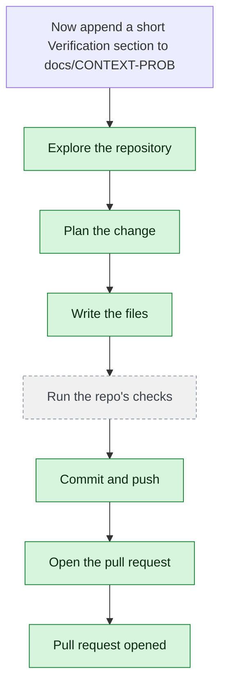

# yjoshi-wwt/example-three-tier-application — 2026-08-18

> Now append a short "Verification" section to docs/CONTEXT-PROBE.md listing the three package-lock files you checked, and re-read src/infrastructure/main.tf and src/web/package-lock.json once more to confirm the versions.

| | |
| --- | --- |
| Job | `31117c06-1737-4c7b-8280-0018a9ea0eab` |
| Repository | [yjoshi-wwt/example-three-tier-application](https://github.com/yjoshi-wwt/example-three-tier-application) |
| Base branch | `main` |
| Work branch | [`agent/b5ed7f1e`](https://github.com/yjoshi-wwt/example-three-tier-application/tree/agent/b5ed7f1e) |
| Pull request | https://github.com/yjoshi-wwt/example-three-tier-application/pull/20 |
| Duration | 197.9s |
| Logs | [CloudWatch Logs Insights](https://us-east-1.console.aws.amazon.com/cloudwatch/home?region=us-east-1#logsV2:logs-insights?queryDetail=~(end~'2026-08-18T06%3A55%3A32.745Z~start~'2026-08-18T06%3A50%3A14.823Z~timeType~'ABSOLUTE~tz~'UTC~editorString~'fields*20*40timestamp*2C*20level*2C*20msg*2C*20jobId*0A*7C*20filter*20jobId*20*3D*20'31117c06-1737-4c7b-8280-0018a9ea0eab'*20or*20*40message*20like*20'31117c06-1737-4c7b-8280-0018a9ea0eab'*0A*7C*20sort*20*40timestamp*20asc*0A*7C*20limit*20500~source~(~'*2Faine-forge*2Forchestrator))) |

## How the run went

The agent was asked to work in **yjoshi-wwt/example-three-tier-application** from `main`. It began by exploring the repository rather than guessing: it opened 5 file(s) — `docs/CONTEXT-PROBE.md`, `src/infrastructure/main.tf`, `src/web/package-lock.json`, `src/api/package-lock.json`, `src/db/package-lock.json`.

From what it read, it settled on 4 step(s):

1. **Append Verification section to docs/CONTEXT-PROBE.md** — Add a new 'Verification' section at the end of the document (before the final References section) that lists the three package-lock files checked (src/api/package-lock.json, src/db/package-lock.json, src/web/package-lock.json) and confirms all versions have been verified against the actual lock files and Terraform configuration.
1. **Re-read src/infrastructure/main.tf** — Open and review src/infrastructure/main.tf to confirm the infrastructure versions and dependencies are correctly documented in the Verification section of docs/CONTEXT-PROBE.md
1. **Re-read src/web/package-lock.json** — Open and review src/web/package-lock.json to confirm the web package versions are correctly documented in the Verification section of docs/CONTEXT-PROBE.md
1. **Verify docs/CONTEXT-PROBE.md Verification section** — Confirm that the Verification section in docs/CONTEXT-PROBE.md accurately lists all three package-lock files (src/api/package-lock.json, src/db/package-lock.json, src/web/package-lock.json) and reflects the confirmed versions from the re-reads

It then wrote 2 file(s) — `docs/CONTEXT-PROBE.md`, `docs/CONTEXT-PROBE.md` — committing each to `agent/b5ed7f1e` as it went. Nothing was committed to the base branch: the only route there is the pull request.

Things that went wrong along the way: **The change described is not in the working branch**.

The run ends at https://github.com/yjoshi-wwt/example-three-tier-application/pull/20, ready for review.

## The route it took

## Every step, in order

| # | Time | Step | What happened |
| --- | --- | --- | --- |
| 1 | 06:51:14 | `message` | Continuing b5ed7f1e on agent/b5ed7f1e |
| 2 | 06:51:14 | `message` | Pinned to global.anthropic.claude-haiku-4-5-20251001-v1:0 by BEDROCK_MODEL_ID |
| 3 | 06:51:14 | `message` | Planning and re-planning as it goes — it continues a paused run; checking its work and fixing what breaks, committing every 120s |
| 4 | 06:51:14 | `run` | Read 3 wiki page(s) for context |
| 5 | 06:51:15 | `state` | Agent state: planning |
| 6 | 06:51:18 | `run` | Read docs/CONTEXT-PROBE.md — `docs/CONTEXT-PROBE.md` |
| 7 | 06:51:19 | `run` | Read src/infrastructure/main.tf — `src/infrastructure/main.tf` |
| 8 | 06:51:21 | `run` | Read src/web/package-lock.json — `src/web/package-lock.json` |
| 9 | 06:51:26 | `run` | Read src/api/package-lock.json — `src/api/package-lock.json` |
| 10 | 06:51:26 | `run` | Read src/db/package-lock.json — `src/db/package-lock.json` |
| 11 | 06:51:34 | `plan` | Append Verification section to docs/CONTEXT-PROBE.md — `Add a new 'Verification' section at the end of the document (before the final References section) that lists the three package-lock files checked (src/api/packa` |
| 12 | 06:51:34 | `commit` | Continuing on branch agent/b5ed7f1e |
| 13 | 06:51:34 | `state` | Agent state: executing |
| 14 | 06:51:41 | `run` | Read docs/CONTEXT-PROBE.md — `docs/CONTEXT-PROBE.md` |
| 15 | 06:51:41 | `run` | Read src/api/package-lock.json — `src/api/package-lock.json` |
| 16 | 06:51:42 | `run` | Read src/db/package-lock.json — `src/db/package-lock.json` |
| 17 | 06:51:44 | `run` | Read src/web/package-lock.json — `src/web/package-lock.json` |
| 18 | 06:51:44 | `run` | Read src/infrastructure/main.tf — `src/infrastructure/main.tf` |
| 19 | 06:52:35 | `edit` | Wrote docs/CONTEXT-PROBE.md — `docs/CONTEXT-PROBE.md` |
| 20 | 06:52:39 | `run` | git diff |
| 21 | 06:52:47 | `run` | Committed 22b21d2 |
| 22 | 06:52:51 | `run` | git status — clean |
| 23 | 06:52:58 | `state` | Agent state: observing |
| 24 | 06:52:58 | `push` | Pushed 1 file(s) to agent/b5ed7f1e |
| 25 | 06:53:03 | `state` | Agent state: planning |
| 26 | 06:53:03 | `plan` | Re-read src/infrastructure/main.tf — `Open and review src/infrastructure/main.tf to confirm the infrastructure versions and dependencies are correctly documented in the Verification section of docs/` |
| 27 | 06:53:03 | `plan` | Re-read src/web/package-lock.json — `Open and review src/web/package-lock.json to confirm the web package versions are correctly documented in the Verification section of docs/CONTEXT-PROBE.md` |
| 28 | 06:53:03 | `plan` | Verify docs/CONTEXT-PROBE.md Verification section — `Confirm that the Verification section in docs/CONTEXT-PROBE.md accurately lists all three package-lock files (src/api/package-lock.json, src/db/package-lock.jso` |
| 29 | 06:53:03 | `state` | Agent state: executing |
| 30 | 06:53:09 | `run` | Read docs/CONTEXT-PROBE.md — `docs/CONTEXT-PROBE.md` |
| 31 | 06:53:10 | `run` | Read src/infrastructure/main.tf — `src/infrastructure/main.tf` |
| 32 | 06:53:11 | `run` | Read src/web/package-lock.json — `src/web/package-lock.json` |
| 33 | 06:53:12 | `run` | Read src/api/package-lock.json — `src/api/package-lock.json` |
| 34 | 06:53:13 | `run` | Read src/db/package-lock.json — `src/db/package-lock.json` |
| 35 | 06:54:06 | `edit` | Wrote docs/CONTEXT-PROBE.md — `docs/CONTEXT-PROBE.md` |
| 36 | 06:54:13 | `run` | Committed 76c3eb0 |
| 37 | 06:54:18 | `run` | git diff — no changes |
| 38 | 06:54:26 | `state` | Agent state: observing |
| 39 | 06:54:26 | `error` | The change described is not in the working branch — `The working branch has an empty diff, but the change describes `docs/CONTEXT-PROBE.md`.` |
| 40 | 06:54:32 | `pr` | Opened PR #20 — `https://github.com/yjoshi-wwt/example-three-tier-application/pull/20` |

---

_Generated by the FORGE code agent. Each interaction gets its own file in `docs/runs/`._