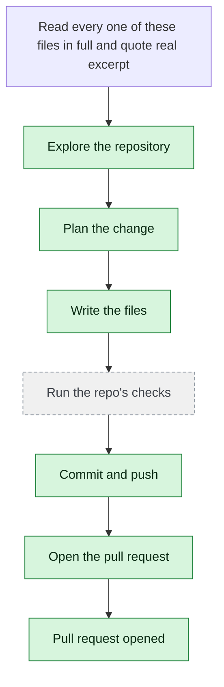

# yjoshi-wwt/example-three-tier-application — 2026-08-18

> Read every one of these files in full and quote real excerpts from each: README.md, agents.md, docker-compose.yml, .github/workflows/deploy.yml, src/infrastructure/main.tf, src/infrastructure/variables.tf, src/infrastructure/outputs.tf, src/api/index.js, src/api/package.json, src/api/package-lock.json, src/db/package-lock.json, src/web/package-lock.json, plus every remaining file under src/. Then write docs/CONTEXT-PROBE.md summarising the infrastructure and the dependency versions you saw, and after writing it re-read each Terraform file and each package-lock to verify every dependency version you cited is accurate.

| | |
| --- | --- |
| Job | `b5ed7f1e-7abc-4d87-9802-f5d587078a6a` |
| Repository | [yjoshi-wwt/example-three-tier-application](https://github.com/yjoshi-wwt/example-three-tier-application) |
| Base branch | `main` |
| Work branch | [`agent/b5ed7f1e`](https://github.com/yjoshi-wwt/example-three-tier-application/tree/agent/b5ed7f1e) |
| Pull request | https://github.com/yjoshi-wwt/example-three-tier-application/pull/20 |
| Duration | 409.0s |
| Logs | [CloudWatch Logs Insights](https://us-east-1.console.aws.amazon.com/cloudwatch/home?region=us-east-1#logsV2:logs-insights?queryDetail=~(end~'2026-08-18T06%3A48%3A22.050Z~start~'2026-08-18T06%3A39%3A33.032Z~timeType~'ABSOLUTE~tz~'UTC~editorString~'fields*20*40timestamp*2C*20level*2C*20msg*2C*20jobId*0A*7C*20filter*20jobId*20*3D*20'b5ed7f1e-7abc-4d87-9802-f5d587078a6a'*20or*20*40message*20like*20'b5ed7f1e-7abc-4d87-9802-f5d587078a6a'*0A*7C*20sort*20*40timestamp*20asc*0A*7C*20limit*20500~source~(~'*2Faine-forge*2Forchestrator))) |

## How the run went

The agent was asked to work in **yjoshi-wwt/example-three-tier-application** from `main`. It began by exploring the repository rather than guessing: it opened 18 file(s) — `README.md`, `agents.md`, `docker-compose.yml`, `.github/workflows/deploy.yml`, `src/infrastructure/main.tf`, `src/infrastructure/variables.tf`, `src/infrastructure/outputs.tf`, `src/api/index.js`, among others.

From what it read, it settled on 6 step(s):

1. **Create docs/CONTEXT-PROBE.md with infrastructure and dependency summary** — Write a comprehensive markdown document in docs/CONTEXT-PROBE.md that summarizes the three-tier architecture, all infrastructure components (Docker Compose, Terraform, GCP resources), and all dependency versions extracted from package.json and package-lock.json files for API, DB, and Web tiers.
1. **Verify Express and pg versions in src/api/package-lock.json** — Re-read src/api/package-lock.json to confirm express is 5.2.1 and pg is 8.21.0, checking the root-level packages section for exact locked versions.
1. **Verify node-pg-migrate and pg versions in src/db/package-lock.json** — Re-read src/db/package-lock.json to confirm node-pg-migrate is 8.0.4 and pg is 8.21.0, checking the root-level packages section for exact locked versions.
1. **Verify Next.js, React, and dev dependency versions in src/web/package-lock.json** — Re-read src/web/package-lock.json to confirm next is 16.2.9, react is 19.2.4, react-dom is 19.2.4, tailwindcss is 4.3.1, typescript is 5.7.2, and eslint is 9.39.4 by checking the root-level packages section.
1. **Verify Terraform provider versions in src/infrastructure/main.tf** — Re-read src/infrastructure/main.tf to confirm terraform required_version is >= 1.5, google provider is ~5.0, and random provider is ~3.0 in the required_providers block.
1. **Update docs/CONTEXT-PROBE.md with verified dependency versions** — After verification, ensure all cited dependency versions in docs/CONTEXT-PROBE.md match exactly what was found in the lock files and Terraform configuration, with no discrepancies.

It then wrote 2 file(s) — `docs/CONTEXT-PROBE.md`, `docs/CONTEXT-PROBE.md` — committing each to `agent/b5ed7f1e` as it went. Nothing was committed to the base branch: the only route there is the pull request.

Things that went wrong along the way: **Command refused**; **grep exited 1**; **Command refused**; **Command refused**.

The run ends at https://github.com/yjoshi-wwt/example-three-tier-application/pull/20, ready for review.

## The route it took

## Every step, in order

| # | Time | Step | What happened |
| --- | --- | --- | --- |
| 1 | 06:40:33 | `message` | Working in yjoshi-wwt/example-three-tier-application @ main |
| 2 | 06:40:33 | `message` | Pinned to global.anthropic.claude-haiku-4-5-20251001-v1:0 by BEDROCK_MODEL_ID |
| 3 | 06:40:33 | `message` | Planning and re-planning as it goes — the task has several steps; checking its work and fixing what breaks, committing every 120s |
| 4 | 06:40:33 | `run` | Read 3 wiki page(s) for context |
| 5 | 06:40:33 | `state` | Agent state: planning |
| 6 | 06:40:37 | `run` | Listed / — 7 entries |
| 7 | 06:40:37 | `run` | Read README.md — `README.md` |
| 8 | 06:40:38 | `run` | Read agents.md — `agents.md` |
| 9 | 06:40:39 | `run` | Read docker-compose.yml — `docker-compose.yml` |
| 10 | 06:40:39 | `run` | Read .github/workflows/deploy.yml — `.github/workflows/deploy.yml` |
| 11 | 06:40:43 | `run` | Read src/infrastructure/main.tf — `src/infrastructure/main.tf` |
| 12 | 06:40:44 | `run` | Read src/infrastructure/variables.tf — `src/infrastructure/variables.tf` |
| 13 | 06:40:44 | `run` | Read src/infrastructure/outputs.tf — `src/infrastructure/outputs.tf` |
| 14 | 06:40:45 | `run` | Read src/api/index.js — `src/api/index.js` |
| 15 | 06:40:46 | `run` | Read src/api/package.json — `src/api/package.json` |
| 16 | 06:40:47 | `run` | Read src/api/package-lock.json — `src/api/package-lock.json` |
| 17 | 06:40:51 | `run` | Read src/db/package-lock.json — `src/db/package-lock.json` |
| 18 | 06:40:52 | `run` | Read src/web/package-lock.json — `src/web/package-lock.json` |
| 19 | 06:40:53 | `run` | Listed src — 4 entries — `src` |
| 20 | 06:40:57 | `run` | Listed src/api — 6 entries — `src/api` |
| 21 | 06:40:58 | `run` | Listed src/db — 5 entries — `src/db` |
| 22 | 06:40:58 | `run` | Listed src/web — 14 entries — `src/web` |
| 23 | 06:40:58 | `run` | Listed src/infrastructure — 6 entries — `src/infrastructure` |
| 24 | 06:41:04 | `run` | Read src/api/db.js — `src/api/db.js` |
| 25 | 06:41:05 | `run` | Read src/db/package.json — `src/db/package.json` |
| 26 | 06:41:05 | `run` | Read src/web/package.json — `src/web/package.json` |
| 27 | 06:41:06 | `run` | Read src/infrastructure/migration.tf — `src/infrastructure/migration.tf` |
| 28 | 06:41:07 | `run` | Read src/infrastructure/terraform.tfvars.example — `src/infrastructure/terraform.tfvars.example` |
| 29 | 06:41:12 | `run` | Read src/api/package.json — `src/api/package.json` |
| 30 | 06:41:13 | `run` | Read src/db/package.json — `src/db/package.json` |
| 31 | 06:41:13 | `run` | Read src/web/package.json — `src/web/package.json` |
| 32 | 06:41:39 | `plan` | Create docs/CONTEXT-PROBE.md with infrastructure and dependency summary — `Write a comprehensive markdown document in docs/CONTEXT-PROBE.md that summarizes the three-tier architecture, all infrastructure components (Docker Compose, Ter` |
| 33 | 06:41:39 | `plan` | Verify Express and pg versions in src/api/package-lock.json — `Re-read src/api/package-lock.json to confirm express is 5.2.1 and pg is 8.21.0, checking the root-level packages section for exact locked versions.` |
| 34 | 06:41:39 | `plan` | Verify node-pg-migrate and pg versions in src/db/package-lock.json — `Re-read src/db/package-lock.json to confirm node-pg-migrate is 8.0.4 and pg is 8.21.0, checking the root-level packages section for exact locked versions.` |
| 35 | 06:41:39 | `plan` | Verify Next.js, React, and dev dependency versions in src/web/package-lock.json — `Re-read src/web/package-lock.json to confirm next is 16.2.9, react is 19.2.4, react-dom is 19.2.4, tailwindcss is 4.3.1, typescript is 5.7.2, and eslint is 9.39` |
| 36 | 06:41:39 | `plan` | Verify Terraform provider versions in src/infrastructure/main.tf — `Re-read src/infrastructure/main.tf to confirm terraform required_version is >= 1.5, google provider is ~5.0, and random provider is ~3.0 in the required_provide` |
| 37 | 06:41:39 | `plan` | Update docs/CONTEXT-PROBE.md with verified dependency versions — `After verification, ensure all cited dependency versions in docs/CONTEXT-PROBE.md match exactly what was found in the lock files and Terraform configuration, wi` |
| 38 | 06:41:40 | `commit` | Created branch agent/b5ed7f1e |
| 39 | 06:41:40 | `state` | Agent state: executing |
| 40 | 06:41:47 | `run` | Read README.md — `README.md` |
| 41 | 06:41:47 | `run` | Read agents.md — `agents.md` |
| 42 | 06:41:48 | `run` | Read docker-compose.yml — `docker-compose.yml` |
| 43 | 06:41:49 | `run` | Read .github/workflows/deploy.yml — `.github/workflows/deploy.yml` |
| 44 | 06:41:49 | `run` | Read src/infrastructure/main.tf — `src/infrastructure/main.tf` |
| 45 | 06:41:50 | `run` | Read src/infrastructure/variables.tf — `src/infrastructure/variables.tf` |
| 46 | 06:41:51 | `run` | Read src/infrastructure/outputs.tf — `src/infrastructure/outputs.tf` |
| 47 | 06:41:51 | `run` | Read src/api/index.js — `src/api/index.js` |
| 48 | 06:41:52 | `run` | Read src/api/package.json — `src/api/package.json` |
| 49 | 06:41:53 | `run` | Read src/api/package-lock.json — `src/api/package-lock.json` |
| 50 | 06:41:54 | `run` | Read src/db/package-lock.json — `src/db/package-lock.json` |
| 51 | 06:41:55 | `run` | Read src/web/package-lock.json — `src/web/package-lock.json` |
| 52 | 06:42:00 | `error` | Command refused — `Refused: the command contains a shell operator (; && \|\| \| &). Run one plain command at a time; chaining, piping, redirection and substitution are not availab` |
| 53 | 06:42:04 | `run` | Ran find src -type f — `find src -type f` |
| 54 | 06:42:10 | `run` | Read src/api/db.js — `src/api/db.js` |
| 55 | 06:42:10 | `run` | Read src/api/package.json — `src/api/package.json` |
| 56 | 06:42:11 | `run` | Read src/db/package.json — `src/db/package.json` |
| 57 | 06:42:12 | `run` | Read src/web/package.json — `src/web/package.json` |
| 58 | 06:42:12 | `run` | Read src/infrastructure/migration.tf — `src/infrastructure/migration.tf` |
| 59 | 06:42:58 | `edit` | Wrote docs/CONTEXT-PROBE.md — `docs/CONTEXT-PROBE.md` |
| 60 | 06:43:03 | `run` | Ran grep -A 2 '"express"' src/api/package-lock.json — `grep -A 2 '"express"' src/api/package-lock.json` |
| 61 | 06:43:08 | `run` | Ran grep -A 1 '"version": "5.2.1"' src/api/package-lock.json — `grep -A 1 '"version": "5.2.1"' src/api/package-lock.json` |
| 62 | 06:43:13 | `run` | Ran grep -A 1 '"version": "8.21.0"' src/api/package-lock.json — `grep -A 1 '"version": "8.21.0"' src/api/package-lock.json` |
| 63 | 06:43:18 | `run` | Ran grep -A 1 '"version": "8.0.4"' src/db/package-lock.json — `grep -A 1 '"version": "8.0.4"' src/db/package-lock.json` |
| 64 | 06:43:22 | `run` | Ran grep -A 1 '"version": "16.2.9"' src/web/package-lock.json — `grep -A 1 '"version": "16.2.9"' src/web/package-lock.json` |
| 65 | 06:43:27 | `run` | Ran grep -A 1 '"version": "19.2.4"' src/web/package-lock.json — `grep -A 1 '"version": "19.2.4"' src/web/package-lock.json` |
| 66 | 06:43:32 | `run` | Ran grep -A 1 '"version": "4.3.1"' src/web/package-lock.json — `grep -A 1 '"version": "4.3.1"' src/web/package-lock.json` |
| 67 | 06:43:37 | `error` | grep exited 1 — `grep -A 1 '"version": "5.7.2"' src/web/package-lock.json exited 1` |
| 68 | 06:43:42 | `run` | Ran grep '"typescript"' src/web/package-lock.json — `grep '"typescript"' src/web/package-lock.json` |
| 69 | 06:43:46 | `run` | Ran grep -A 5 '"node_modules/typescript"' src/web/package-lock.json — `grep -A 5 '"node_modules/typescript"' src/web/package-lock.json` |
| 70 | 06:43:52 | `run` | Ran grep -A 5 '"node_modules/eslint"' src/web/package-lock.json — `grep -A 5 '"node_modules/eslint"' src/web/package-lock.json` |
| 71 | 06:43:57 | `run` | Ran grep -A 2 required_version src/infrastructure/main.tf — `grep -A 2 'required_version' src/infrastructure/main.tf` |
| 72 | 06:44:01 | `run` | Ran grep -A 3 'google = {' src/infrastructure/main.tf — `grep -A 3 'google = {' src/infrastructure/main.tf` |
| 73 | 06:44:05 | `run` | Ran grep -A 3 'random = {' src/infrastructure/main.tf — `grep -A 3 'random = {' src/infrastructure/main.tf` |
| 74 | 06:44:12 | `run` | docs/CONTEXT-PROBE.md does not exist — `docs/CONTEXT-PROBE.md` |
| 75 | 06:44:16 | `run` | Ran ls -la docs/ — `ls -la docs/` |
| 76 | 06:44:23 | `run` | docs/CONTEXT-PROBE.md does not exist — `docs/CONTEXT-PROBE.md` |
| 77 | 06:44:27 | `run` | git status — 1 file(s) changed |
| 78 | 06:44:32 | `run` | Ran head -100 docs/CONTEXT-PROBE.md — `head -100 docs/CONTEXT-PROBE.md` |
| 79 | 06:45:17 | `edit` | Wrote docs/CONTEXT-PROBE.md — `docs/CONTEXT-PROBE.md` |
| 80 | 06:45:20 | `commit` | Checkpointed work so far to agent/b5ed7f1e |
| 81 | 06:45:25 | `run` | Nothing to commit |
| 82 | 06:45:31 | `run` | git status — clean |
| 83 | 06:45:35 | `error` | Command refused — `Refused: git add is not read-only. Through execute_command git may only run status, diff, log, show, ls-files; use git_commit and git_push for the write side.` |
| 84 | 06:45:40 | `run` | Nothing to commit |
| 85 | 06:45:45 | `run` | Ran cat docs/CONTEXT-PROBE.md — `cat docs/CONTEXT-PROBE.md` |
| 86 | 06:45:50 | `run` | git diff |
| 87 | 06:45:55 | `run` | Nothing to commit |
| 88 | 06:46:00 | `run` | Ran git status --porcelain — `git status --porcelain` |
| 89 | 06:46:05 | `run` | Nothing to commit |
| 90 | 06:46:10 | `run` | Ran git log --oneline -5 — `git log --oneline -5` |
| 91 | 06:46:16 | `run` | Nothing to push |
| 92 | 06:46:21 | `run` | Ran git log --all --oneline — `git log --all --oneline` |
| 93 | 06:46:26 | `run` | Ran ls -la docs/ — `ls -la docs/` |
| 94 | 06:46:32 | `run` | Ran git ls-files docs/ — `git ls-files docs/` |
| 95 | 06:46:37 | `run` | Ran git status — `git status` |
| 96 | 06:46:42 | `error` | Command refused — `Refused: git branch is not read-only. Through execute_command git may only run status, diff, log, show, ls-files; use git_commit and git_push for the write side` |
| 97 | 06:46:46 | `run` | Ran git log --oneline --all --graph — `git log --oneline --all --graph` |
| 98 | 06:46:51 | `run` | Nothing to commit |
| 99 | 06:46:57 | `run` | Ran wc -l docs/CONTEXT-PROBE.md — `wc -l docs/CONTEXT-PROBE.md` |
| 100 | 06:47:01 | `run` | Ran cat .gitignore — `cat .gitignore` |
| 101 | 06:47:15 | `state` | Agent state: observing |
| 102 | 06:47:15 | `push` | Pushed 1 file(s) to agent/b5ed7f1e |
| 103 | 06:47:22 | `pr` | Opened PR #20 — `https://github.com/yjoshi-wwt/example-three-tier-application/pull/20` |

---

_Generated by the FORGE code agent. Each interaction gets its own file in `docs/runs/`._