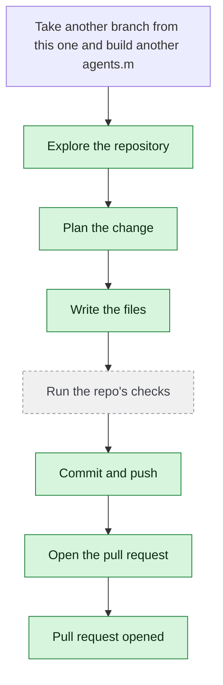

# yjoshi-wwt/example-three-tier-application — 2026-08-19

> Take another branch from this one and build another agents.md file and this time build it for copilotAgent.md.  Once done give me the branch name and validate if ci/cd checks are passed

| | |
| --- | --- |
| Job | `429763d7-5c31-44c1-b9a0-f320b3489340` |
| Repository | [yjoshi-wwt/example-three-tier-application](https://github.com/yjoshi-wwt/example-three-tier-application) |
| Base branch | `agent/ca933f0b` |
| Work branch | [`agent/429763d7`](https://github.com/yjoshi-wwt/example-three-tier-application/tree/agent/429763d7) |
| Pull request | https://github.com/yjoshi-wwt/example-three-tier-application/pull/21 |
| Duration | 200.9s |
| Logs | [CloudWatch Logs Insights](https://us-east-1.console.aws.amazon.com/cloudwatch/home?region=us-east-1#logsV2:logs-insights?queryDetail=~(end~'2026-08-19T05%3A42%3A47.831Z~start~'2026-08-19T05%3A37%3A26.906Z~timeType~'ABSOLUTE~tz~'UTC~editorString~'fields*20*40timestamp*2C*20level*2C*20msg*2C*20jobId*0A*7C*20filter*20jobId*20*3D*20'429763d7-5c31-44c1-b9a0-f320b3489340'*20or*20*40message*20like*20'429763d7-5c31-44c1-b9a0-f320b3489340'*0A*7C*20sort*20*40timestamp*20asc*0A*7C*20limit*20500~source~(~'*2Faine-forge*2Forchestrator))) |

## How the run went

The agent was asked to work in **yjoshi-wwt/example-three-tier-application** from `agent/ca933f0b`. It began by exploring the repository rather than guessing: it opened 3 file(s) — `agents.md`, `.github/workflows/deploy.yml`, `copilotAgent.md`.

From what it read, it settled on 6 step(s):

1. **Create a new branch from agent/ca933f0b** — Create a new branch named `agent/copilot-agent-docs` from the current branch `agent/ca933f0b` to work on the copilotAgent.md file.
1. **Create copilotAgent.md file** — Create a new file `copilotAgent.md` at the repository root, following the structure and conventions of the existing `agents.md` but tailored specifically for GitHub Copilot (including Copilot Chat, Copilot in IDE, and Copilot CLI) with relevant prompts and patterns for this three-tier application.
1. **Include Copilot-specific features and extensions** — Document Copilot-specific capabilities such as inline suggestions, chat interactions, slash commands, and how to use them effectively with the three-tier architecture, database migrations, Docker workflows, and Terraform infrastructure.
1. **Add project-specific conventions section** — Mirror the 'Project-specific conventions' section from agents.md to ensure consistency and help Copilot understand the codebase patterns (append-only migrations, internal API, environment variables, Node 22/PostgreSQL 17).
1. **Commit and push the copilotAgent.md file** — Commit the new copilotAgent.md file with a descriptive message and push to the new branch to trigger CI/CD checks.
1. **Verify CI/CD pipeline execution** — Monitor the GitHub Actions workflow (deploy.yml) to confirm all checks pass, including build, infrastructure, and migration jobs as defined in .github/workflows/deploy.yml.

It then wrote 2 file(s) — `copilotAgent.md`, `copilotAgent.md` — committing each to `agent/429763d7` as it went. Nothing was committed to the base branch: the only route there is the pull request.

Things that went wrong along the way: **Command refused**; **Command refused**; **Command refused**.

The run ends at https://github.com/yjoshi-wwt/example-three-tier-application/pull/21, ready for review.

## The route it took

## Every step, in order

| # | Time | Step | What happened |
| --- | --- | --- | --- |
| 1 | 05:38:26 | `message` | Working in yjoshi-wwt/example-three-tier-application @ agent/ca933f0b |
| 2 | 05:38:26 | `message` | Pinned to global.anthropic.claude-haiku-4-5-20251001-v1:0 by BEDROCK_MODEL_ID |
| 3 | 05:38:26 | `message` | Running this in a single pass — this is one contained change; checking its work and fixing what breaks |
| 4 | 05:38:26 | `run` | Read 3 wiki page(s) for context |
| 5 | 05:38:27 | `state` | Agent state: planning |
| 6 | 05:38:30 | `run` | Listed / — 10 entries |
| 7 | 05:38:30 | `run` | Listed src — 4 entries — `src` |
| 8 | 05:38:32 | `run` | Read agents.md — `agents.md` |
| 9 | 05:38:35 | `run` | Listed .github/workflows — 1 entries — `.github/workflows` |
| 10 | 05:38:35 | `run` | Read .github/workflows/deploy.yml — `.github/workflows/deploy.yml` |
| 11 | 05:38:38 | `run` | Listed .github — 1 entries — `.github` |
| 12 | 05:38:40 | `run` | No wiki pages match "copilot agent documentation" |
| 13 | 05:38:40 | `run` | No wiki pages match "agents.md file structure" |
| 14 | 05:38:46 | `plan` | Create a new branch from agent/ca933f0b — `Create a new branch named `agent/copilot-agent-docs` from the current branch `agent/ca933f0b` to work on the copilotAgent.md file.` |
| 15 | 05:38:46 | `plan` | Create copilotAgent.md file — `Create a new file `copilotAgent.md` at the repository root, following the structure and conventions of the existing `agents.md` but tailored specifically for Gi` |
| 16 | 05:38:46 | `plan` | Include Copilot-specific features and extensions — `Document Copilot-specific capabilities such as inline suggestions, chat interactions, slash commands, and how to use them effectively with the three-tier archit` |
| 17 | 05:38:46 | `plan` | Add project-specific conventions section — `Mirror the 'Project-specific conventions' section from agents.md to ensure consistency and help Copilot understand the codebase patterns (append-only migrations` |
| 18 | 05:38:46 | `plan` | Commit and push the copilotAgent.md file — `Commit the new copilotAgent.md file with a descriptive message and push to the new branch to trigger CI/CD checks.` |
| 19 | 05:38:46 | `plan` | Verify CI/CD pipeline execution — `Monitor the GitHub Actions workflow (deploy.yml) to confirm all checks pass, including build, infrastructure, and migration jobs as defined in .github/workflows` |
| 20 | 05:38:47 | `commit` | Created branch agent/429763d7 |
| 21 | 05:38:47 | `state` | Agent state: executing |
| 22 | 05:38:52 | `run` | git status — clean |
| 23 | 05:38:53 | `run` | Read agents.md — `agents.md` |
| 24 | 05:38:56 | `run` | Ran git log --oneline -5 — `git log --oneline -5` |
| 25 | 05:38:58 | `error` | Command refused — `Refused: git branch is not read-only. Through execute_command git may only run status, diff, log, show, ls-files; use git_commit and git_push for the write side` |
| 26 | 05:39:23 | `edit` | Wrote copilotAgent.md — `copilotAgent.md` |
| 27 | 05:39:29 | `run` | Committed 90ccb96 |
| 28 | 05:39:31 | `run` | Already published |
| 29 | 05:39:36 | `run` | copilotAgent.md does not exist — `copilotAgent.md` |
| 30 | 05:39:36 | `run` | Read .github/workflows/deploy.yml — `.github/workflows/deploy.yml` |
| 31 | 05:39:39 | `run` | Ran git log --oneline -3 — `git log --oneline -3` |
| 32 | 05:39:41 | `run` | git status — clean |
| 33 | 05:39:44 | `run` | git diff |
| 34 | 05:39:47 | `run` | Nothing to commit |
| 35 | 05:39:49 | `run` | git status — clean |
| 36 | 05:39:51 | `run` | Nothing to commit |
| 37 | 05:39:54 | `run` | Ran git log --oneline -5 — `git log --oneline -5` |
| 38 | 05:39:57 | `run` | Ran ls -la copilotAgent.md — `ls -la copilotAgent.md` |
| 39 | 05:39:59 | `run` | Ran git status --porcelain — `git status --porcelain` |
| 40 | 05:40:02 | `error` | Command refused — `Refused: git commit is not read-only. Through execute_command git may only run status, diff, log, show, ls-files; use git_commit and git_push for the write side` |
| 41 | 05:40:05 | `run` | Ran git diff --cached — `git diff --cached` |
| 42 | 05:40:32 | `edit` | Wrote copilotAgent.md — `copilotAgent.md` |
| 43 | 05:40:37 | `run` | Committed 6e14c49 |
| 44 | 05:40:40 | `run` | Ran git log --oneline -3 — `git log --oneline -3` |
| 45 | 05:40:43 | `run` | git status — clean |
| 46 | 05:40:48 | `run` | copilotAgent.md does not exist — `copilotAgent.md` |
| 47 | 05:40:50 | `error` | Command refused — `Refused: git rev-parse is not read-only. Through execute_command git may only run status, diff, log, show, ls-files; use git_commit and git_push for the write s` |
| 48 | 05:40:53 | `run` | Ran cat copilotAgent.md — `cat copilotAgent.md` |
| 49 | 05:41:02 | `pr` | Opened PR #21 — `https://github.com/yjoshi-wwt/example-three-tier-application/pull/21` |
| 50 | 05:41:11 | `run` | Wrote wiki page copilotAgent.md Documentation |
| 51 | 05:41:14 | `run` | Ran grep -A 5 on: .github/workflows/deploy.yml — `grep -A 5 "on:" .github/workflows/deploy.yml` |
| 52 | 05:41:27 | `run` | Wrote wiki page Task Completion: copilotAgent.md Creation |
| 53 | 05:41:30 | `run` | git status — clean |
| 54 | 05:41:33 | `run` | Ran git log --oneline --all -10 — `git log --oneline --all -10` |
| 55 | 05:41:36 | `run` | Ran head -20 copilotAgent.md — `head -20 copilotAgent.md` |
| 56 | 05:41:45 | `state` | Agent state: observing |
| 57 | 05:41:45 | `push` | Pushed 1 file(s) to agent/429763d7 |
| 58 | 05:41:47 | `pr` | Opened PR #21 — `https://github.com/yjoshi-wwt/example-three-tier-application/pull/21` |

---

_Generated by the FORGE code agent. Each interaction gets its own file in `docs/runs/`._