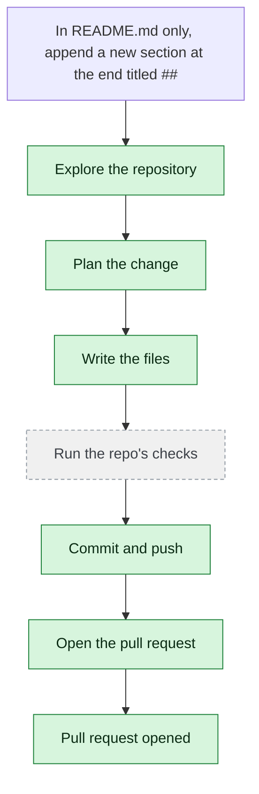

# yjoshi-wwt/example-three-tier-application — 2026-08-21

> In README.md only, append a new section at the end titled '## Forge QA 2026-08-21' with one sentence saying this line was added by a Forge QA validation run. Change no other file.

| | |
| --- | --- |
| Job | `841b372e-8fcd-4388-86e9-61b0e4f3ee52` |
| Repository | [yjoshi-wwt/example-three-tier-application](https://github.com/yjoshi-wwt/example-three-tier-application) |
| Base branch | `main` |
| Work branch | [`agent/841b372e`](https://github.com/yjoshi-wwt/example-three-tier-application/tree/agent/841b372e) |
| Pull request | https://github.com/yjoshi-wwt/example-three-tier-application/pull/22 |
| Duration | 44.0s |
| Logs | [CloudWatch Logs Insights](https://us-east-1.console.aws.amazon.com/cloudwatch/home?region=us-east-1#logsV2:logs-insights?queryDetail=~(end~'2026-08-21T17%3A57%3A43.206Z~start~'2026-08-21T17%3A54%3A59.226Z~timeType~'ABSOLUTE~tz~'UTC~editorString~'fields*20*40timestamp*2C*20level*2C*20msg*2C*20jobId*0A*7C*20filter*20jobId*20*3D*20'841b372e-8fcd-4388-86e9-61b0e4f3ee52'*20or*20*40message*20like*20'841b372e-8fcd-4388-86e9-61b0e4f3ee52'*0A*7C*20sort*20*40timestamp*20asc*0A*7C*20limit*20500~source~(~'*2Faine-forge*2Forchestrator))) |

## How the run went

The agent was asked to work in **yjoshi-wwt/example-three-tier-application** from `main`. It began by exploring the repository rather than guessing: it opened 1 file(s) — `README.md`.

From what it read, it settled on 1 step(s):

1. **Append Forge QA validation section to README.md** — Add a new section at the end of README.md with the heading '## Forge QA 2026-08-21' followed by a single sentence indicating this line was added by a Forge QA validation run.

It then wrote 1 file(s) — `README.md` — committing each to `agent/841b372e` as it went. Nothing was committed to the base branch: the only route there is the pull request.

The run ends at https://github.com/yjoshi-wwt/example-three-tier-application/pull/22, ready for review.

## The route it took

## Every step, in order

| # | Time | Step | What happened |
| --- | --- | --- | --- |
| 1 | 17:55:59 | `message` | Working in yjoshi-wwt/example-three-tier-application @ main |
| 2 | 17:55:59 | `message` | Pinned to global.anthropic.claude-haiku-4-5-20251001-v1:0 by BEDROCK_MODEL_ID |
| 3 | 17:55:59 | `message` | Running this in a single pass — this is one contained change; skipping the checks — no code to break |
| 4 | 17:55:59 | `run` | Read 3 wiki page(s) for context |
| 5 | 17:56:00 | `state` | Agent state: planning |
| 6 | 17:56:05 | `run` | Listed / — 7 entries |
| 7 | 17:56:05 | `run` | Read README.md — `README.md` |
| 8 | 17:56:09 | `plan` | Append Forge QA validation section to README.md — `Add a new section at the end of README.md with the heading '## Forge QA 2026-08-21' followed by a single sentence indicating this line was added by a Forge QA v` |
| 9 | 17:56:10 | `commit` | Created branch agent/841b372e |
| 10 | 17:56:10 | `state` | Agent state: executing |
| 11 | 17:56:17 | `run` | Read README.md — `README.md` |
| 12 | 17:56:27 | `edit` | Wrote README.md — `README.md` |
| 13 | 17:56:29 | `run` | git diff |
| 14 | 17:56:35 | `run` | Committed 7ed0310 |
| 15 | 17:56:37 | `run` | git status — clean |
| 16 | 17:56:40 | `push` | Pushed 1 file(s) to agent/841b372e |
| 17 | 17:56:41 | `state` | Agent state: observing |
| 18 | 17:56:43 | `pr` | Opened PR #22 — `https://github.com/yjoshi-wwt/example-three-tier-application/pull/22` |

---

_Generated by the FORGE code agent. Each interaction gets its own file in `docs/runs/`._